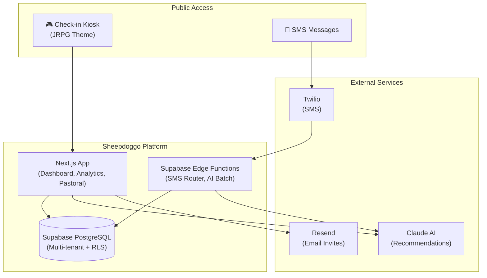

# Sheepdoggo

**Student engagement platform for youth ministries** — Track attendance, build belonging, and shepherd every student with AI-powered pastoral insights.

## What is Sheepdoggo?

Sheepdoggo transforms youth ministry check-ins into meaningful engagement data. Students check in through a fun JRPG-themed kiosk, earn points and achievements, while ministry leaders gain visibility into attendance patterns, engagement levels, and receive AI-powered recommendations for pastoral care.

## Core Value Proposition

- **For Students**: Gamified check-in experience with points, ranks, and achievements
- **For Leaders**: Real-time visibility into who's engaged, who's drifting, and what to do about it
- **For Ministry**: Data-driven pastoral care that scales

## System Overview

## Features

| Feature | Description | Status | Docs |
|---------|-------------|--------|------|
| [Check-in System](./features/01-check-in.md) | JRPG-themed public kiosk for student check-ins | 🟢 Complete | → |
| [Gamification](./features/02-gamification.md) | Points, ranks, achievements, leaderboards | 🟢 Complete | → |
| [Belonging Spectrum](./features/03-belonging-spectrum.md) | Visual engagement classification (5 tiers) | 🟢 Complete | → |
| [AI Recommendations](./features/04-ai-recommendations.md) | Claude-powered pastoral insights | 🟢 Complete | → |
| [Groups](./features/05-groups.md) | Student groups with leaders and schedules | 🟢 Complete | → |
| [Attendance](./features/06-attendance.md) | Today's feed, history, manual entry | 🟢 Complete | → |
| [Analytics](./features/07-analytics.md) | Charts, trends, engagement funnel | 🟢 Complete | → |
| [People Directory](./features/08-people-directory.md) | Searchable student profiles | 🟢 Complete | → |
| [SMS Messaging](./features/09-sms.md) | Two-way texting with conversation threads | 🟡 In Progress | → |
| [Curriculum](./features/10-curriculum.md) | Weekly teaching content for AI context | 🟢 Complete | → |
| [Settings](./features/11-settings.md) | Team management, org tools | 🟢 Complete | → |
| [Admin Panel](./features/12-admin.md) | Super admin platform management | 🟢 Complete | → |

## Tech Stack

| Layer | Technology |
|-------|------------|
| **Framework** | Next.js 14 (App Router) |
| **Database** | Supabase (PostgreSQL + RLS) |
| **Auth** | Supabase Auth |
| **UI** | shadcn/ui + Tailwind CSS + Radix UI |
| **State** | TanStack Query (React Query) |
| **Charts** | Recharts |
| **AI** | Anthropic Claude API |
| **SMS** | Twilio |
| **Email** | Resend |

## Documentation

### Getting Started
- [Developer Onboarding](./getting-started.md) — Setup guide for new engineers
- [Architecture](./architecture.md) — System design and patterns

### Technical Reference
- [Database Schema](./database.md) — Tables, relationships, RLS policies
- [API Reference](./api-reference.md) — RPC functions and endpoints
- [Integrations](./integrations.md) — External service configuration

### Planning
- [Roadmap](./roadmap.md) — What's done, what's next

## Quick Links

- **Staging Dashboard**: https://supabase.com/dashboard/project/vilpdnwkfsmvqsiktqdf
- **Production Dashboard**: https://supabase.com/dashboard/project/hhjvsvezinrbxeropeyl
- **GitHub Repository**: https://github.com/darrenallarde/esscheckin-next
