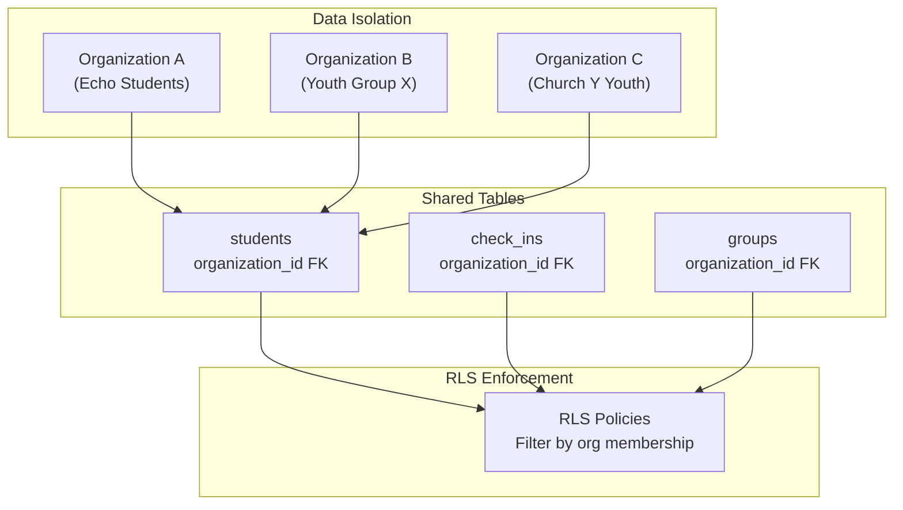
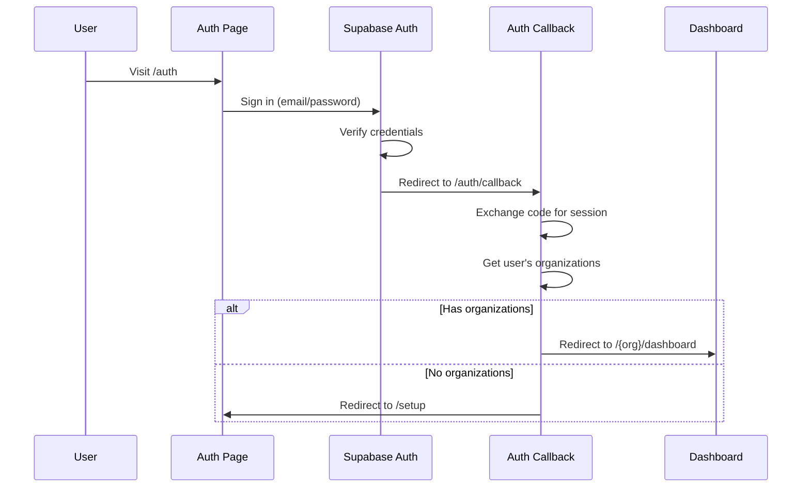
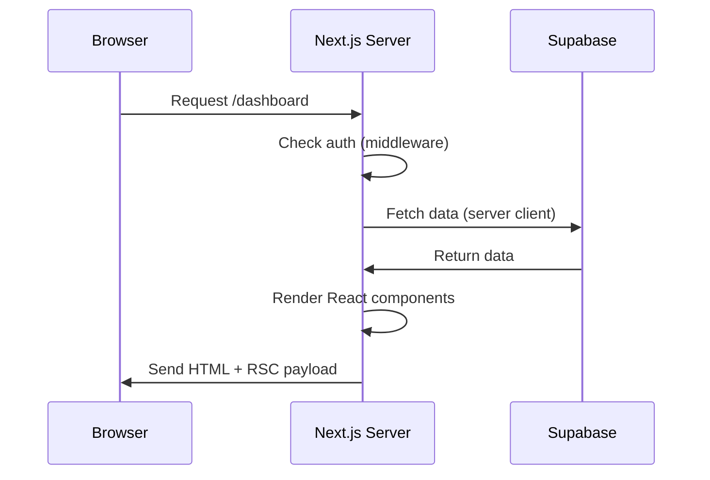
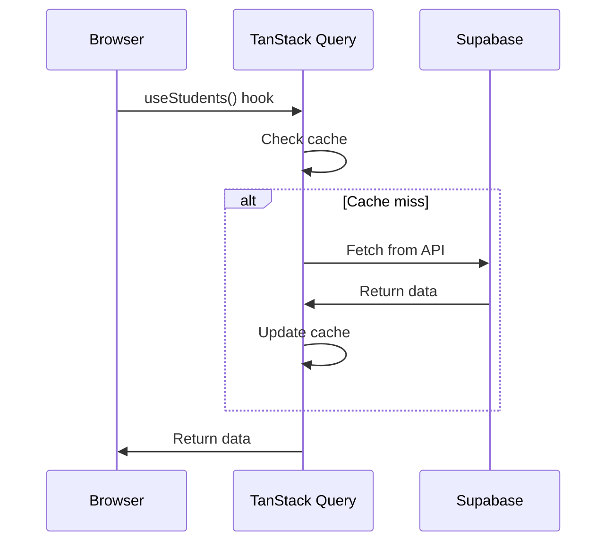
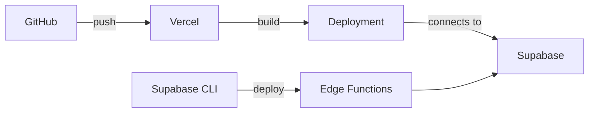

# Architecture

System design and patterns used in Sheepdoggo.

## Tech Stack

| Layer | Technology | Purpose |
|-------|------------|---------|
| **Framework** | Next.js 14 | App Router, server components, API routes |
| **Database** | Supabase PostgreSQL | Multi-tenant data storage with RLS |
| **Auth** | Supabase Auth | Email/password, magic link, OAuth |
| **UI Framework** | shadcn/ui | Pre-built accessible components |
| **Styling** | Tailwind CSS | Utility-first CSS |
| **Primitives** | Radix UI | Headless accessible components |
| **Forms** | react-hook-form + zod | Form state and validation |
| **Data Fetching** | TanStack Query | Server state management and caching |
| **Charts** | Recharts | Data visualization |
| **AI** | Anthropic Claude | Pastoral recommendations |
| **SMS** | Twilio | Two-way messaging |
| **Email** | Resend | Team invitations |

## Multi-Tenant Architecture

Sheepdoggo supports multiple organizations (youth ministries) on a single instance. Each organization has isolated data.



### Organization Slug Routing

URLs include the organization slug for context:

```
/echo-students/dashboard    → Echo Students dashboard
/youth-group-x/dashboard    → Youth Group X dashboard
```

The `[org]` dynamic segment in `src/app/(protected)/[org]/` captures the slug.

## Authentication Flow



### Session Management

- Supabase handles session tokens automatically
- Sessions stored in cookies (httpOnly)
- Middleware validates session on protected routes
- Session refreshes automatically before expiry

## Request Flow

### Server Components (Default)



### Client Components (Interactive)



## Row Level Security (RLS)

All tables use RLS policies to enforce data isolation. This is critical for multi-tenant security.

### RLS Helper Functions

To prevent infinite recursion (policies calling tables with policies), we use `SECURITY DEFINER` helper functions:

```sql
-- Check if user is super admin (bypasses RLS)
CREATE FUNCTION auth_is_super_admin(user_id UUID)
RETURNS BOOLEAN
SECURITY DEFINER
SET search_path = public
AS $$
  SELECT EXISTS (
    SELECT 1 FROM organization_members
    WHERE user_id = $1 AND role = 'super_admin'
  );
$$ LANGUAGE sql;

-- Get org IDs user belongs to
CREATE FUNCTION auth_user_org_ids(user_id UUID)
RETURNS SETOF UUID
SECURITY DEFINER
SET search_path = public
AS $$
  SELECT organization_id FROM organization_members
  WHERE user_id = $1;
$$ LANGUAGE sql;
```

### Policy Pattern

```sql
-- Example: students table policy
CREATE POLICY "Users can view students in their organizations"
ON students FOR SELECT
USING (
  organization_id IN (SELECT auth_user_org_ids(auth.uid()))
);
```

## File Structure Patterns

### Page Organization

```
src/app/(protected)/[org]/
├── dashboard/
│   └── page.tsx          # Server component (data fetching)
├── attendance/
│   └── page.tsx          # Uses client components for interactivity
└── layout.tsx            # Shared layout with sidebar
```

### Component Organization

```
src/components/
├── feature-name/
│   ├── FeatureComponent.tsx    # Main component
│   ├── SubComponent.tsx        # Sub-components
│   └── index.ts                # Re-exports (optional)
└── ui/
    └── button.tsx              # shadcn/ui components
```

### Hook Organization

```
src/hooks/
├── queries/
│   ├── use-students.ts         # Data fetching
│   ├── use-check-ins.ts
│   └── use-student-pastoral.ts
└── use-custom-hook.ts          # Non-query hooks
```

## Data Flow Patterns

### Server → Client Data

1. **Server Component Fetching** (preferred for initial load):
   ```tsx
   // page.tsx (server component)
   export default async function Page() {
     const supabase = await createClient();
     const { data } = await supabase.from('students').select();
     return <ClientComponent initialData={data} />;
   }
   ```

2. **Client-Side Fetching** (for dynamic/interactive data):
   ```tsx
   // ClientComponent.tsx
   "use client";
   export function ClientComponent() {
     const { data, isLoading } = useStudents(orgId);
     // ...
   }
   ```

### Mutation Pattern

```tsx
// Component with mutation
const mutation = useMutation({
  mutationFn: async (data) => {
    const supabase = createClient();
    return supabase.from('table').insert(data);
  },
  onSuccess: () => {
    queryClient.invalidateQueries({ queryKey: ['related-query'] });
  },
});
```

## API Routes

API routes live in `src/app/api/` and handle:

1. **External Webhooks** (Twilio SMS)
2. **Server-Side AI Calls** (Anthropic API key protected)
3. **Complex Operations** (multi-step transactions)

```
src/app/api/
├── recommendations/
│   └── generate/route.ts    # POST - Generate AI recommendation
└── sms/
    ├── receive/route.ts     # POST - Twilio webhook
    └── send/route.ts        # POST - Send SMS
```

## Edge Functions

Supabase Edge Functions handle:

1. **SMS Routing** - NPC router for inbound messages
2. **Batch AI Generation** - Scheduled recommendation generation

```
supabase/functions/
├── receive-sms/            # Twilio webhook → NPC routing
└── generate-recommendations/  # Batch AI (cron scheduled)
```

## Error Handling

### Client-Side

```tsx
const { data, error, isError } = useQuery({...});

if (isError) {
  return <ErrorCard message={error.message} />;
}
```

### Server-Side

```tsx
// API Route
export async function POST(request: Request) {
  try {
    // ... operation
  } catch (error) {
    console.error('Operation failed:', error);
    return NextResponse.json(
      { error: error.message },
      { status: 500 }
    );
  }
}
```

## Performance Considerations

### Query Caching

TanStack Query caches data with configurable stale times:

```tsx
useQuery({
  queryKey: ['students', orgId],
  queryFn: fetchStudents,
  staleTime: 1000 * 60,      // 1 minute before refetch
  refetchInterval: 60000,    // Auto-refetch every minute
});
```

### Bundle Optimization

- Server components don't ship JS to client
- Client components are code-split automatically
- `use client` boundary is deliberate

### Database Optimization

- RPC functions for complex queries
- Indexes on frequently filtered columns
- Materialized views for analytics (future)

## Security Model

| Layer | Protection |
|-------|------------|
| **Network** | HTTPS only, Supabase handles TLS |
| **Auth** | Supabase Auth with secure session cookies |
| **Data** | RLS policies on every table |
| **API Keys** | Server-side only (ANTHROPIC_API_KEY, TWILIO_*) |
| **Input** | Zod validation on forms and API routes |
| **XSS** | React's default escaping + CSP headers |

## Deployment

### Vercel (Frontend)

- Auto-deploy from `main` branch
- Environment variables in Vercel dashboard
- Edge runtime for API routes (optional)

### Supabase (Backend)

- Managed PostgreSQL
- Edge Functions deployed via CLI
- Automatic backups


