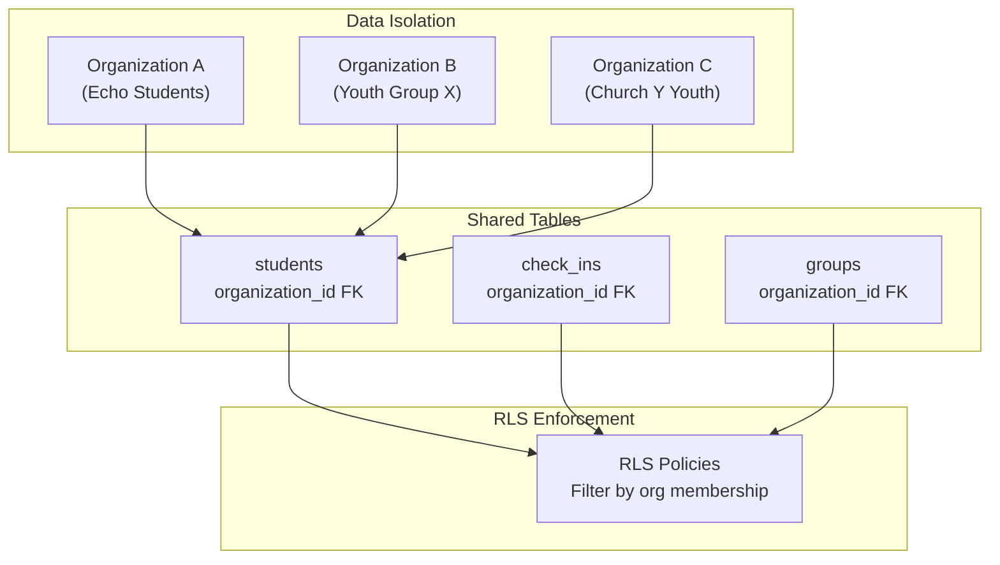
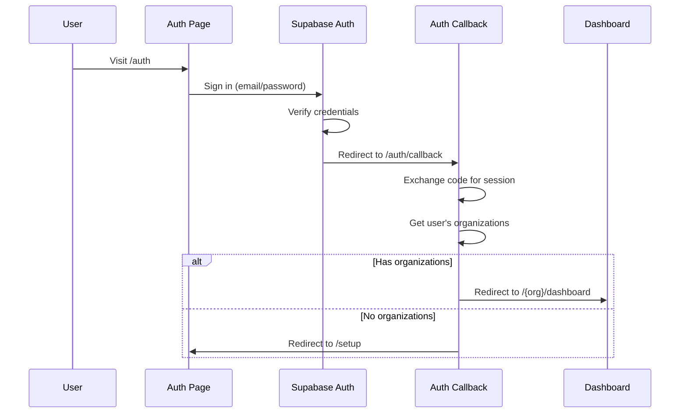
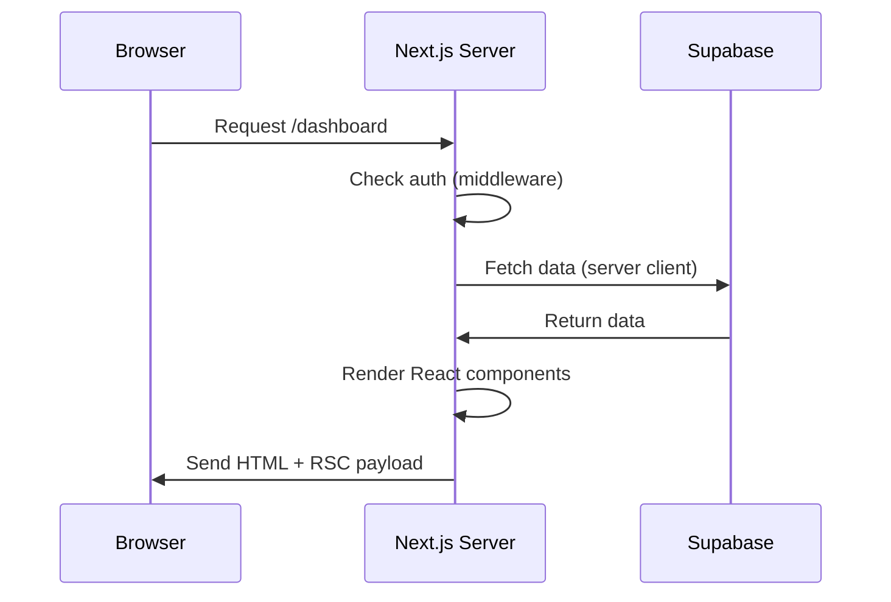
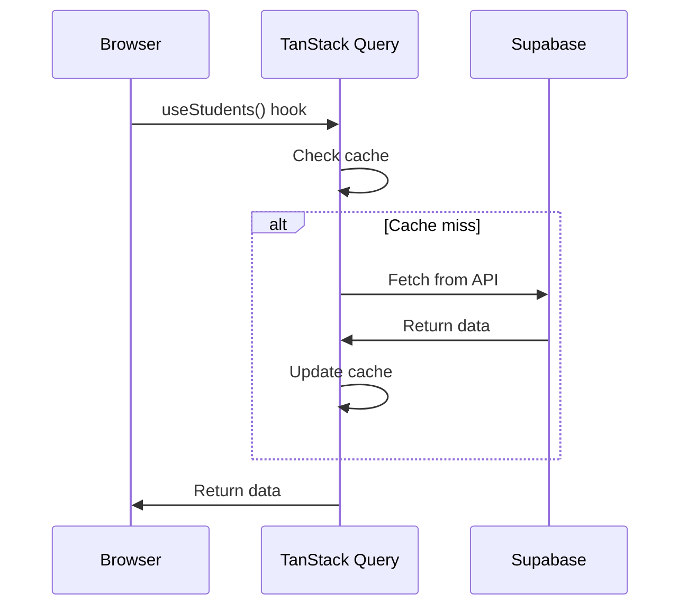
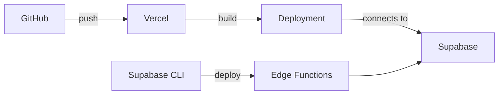

# Architecture

System design and patterns used in Sheepdoggo.

## Tech Stack

| Layer | Technology | Purpose |
|-------|------------|---------|
| **Framework** | Next.js 14 | App Router, server components, API routes |
| **Database** | Supabase PostgreSQL | Multi-tenant data storage with RLS |
| **Auth** | Supabase Auth | Email/password, magic link, OAuth |
| **UI Framework** | shadcn/ui | Pre-built accessible components |
| **Styling** | Tailwind CSS | Utility-first CSS |
| **Primitives** | Radix UI | Headless accessible components |
| **Forms** | react-hook-form + zod | Form state and validation |
| **Data Fetching** | TanStack Query | Server state management and caching |
| **Charts** | Recharts | Data visualization |
| **AI** | Anthropic Claude | Pastoral recommendations |
| **SMS** | Twilio | Two-way messaging |
| **Email** | Resend | Team invitations |

## Multi-Tenant Architecture

Sheepdoggo supports multiple organizations (youth ministries) on a single instance. Each organization has isolated data.



### Organization Slug Routing

URLs include the organization slug for context:

```
/echo-students/dashboard    → Echo Students dashboard
/youth-group-x/dashboard    → Youth Group X dashboard
```

The `[org]` dynamic segment in `src/app/(protected)/[org]/` captures the slug.

## Authentication Flow



### Session Management

- Supabase handles session tokens automatically
- Sessions stored in cookies (httpOnly)
- Middleware validates session on protected routes
- Session refreshes automatically before expiry

## Request Flow

### Server Components (Default)



### Client Components (Interactive)



## Row Level Security (RLS)

All tables use RLS policies to enforce data isolation. This is critical for multi-tenant security.

### RLS Helper Functions

To prevent infinite recursion (policies calling tables with policies), we use `SECURITY DEFINER` helper functions:

```sql
-- Check if user is super admin (bypasses RLS)
CREATE FUNCTION auth_is_super_admin(user_id UUID)
RETURNS BOOLEAN
SECURITY DEFINER
SET search_path = public
AS $$
  SELECT EXISTS (
    SELECT 1 FROM organization_members
    WHERE user_id = $1 AND role = 'super_admin'
  );
$$ LANGUAGE sql;

-- Get org IDs user belongs to
CREATE FUNCTION auth_user_org_ids(user_id UUID)
RETURNS SETOF UUID
SECURITY DEFINER
SET search_path = public
AS $$
  SELECT organization_id FROM organization_members
  WHERE user_id = $1;
$$ LANGUAGE sql;
```

### Policy Pattern

```sql
-- Example: students table policy
CREATE POLICY "Users can view students in their organizations"
ON students FOR SELECT
USING (
  organization_id IN (SELECT auth_user_org_ids(auth.uid()))
);
```

## File Structure Patterns

### Page Organization

```
src/app/(protected)/[org]/
├── dashboard/
│   └── page.tsx          # Server component (data fetching)
├── attendance/
│   └── page.tsx          # Uses client components for interactivity
└── layout.tsx            # Shared layout with sidebar
```

### Component Organization

```
src/components/
├── feature-name/
│   ├── FeatureComponent.tsx    # Main component
│   ├── SubComponent.tsx        # Sub-components
│   └── index.ts                # Re-exports (optional)
└── ui/
    └── button.tsx              # shadcn/ui components
```

### Hook Organization

```
src/hooks/
├── queries/
│   ├── use-students.ts         # Data fetching
│   ├── use-check-ins.ts
│   └── use-student-pastoral.ts
└── use-custom-hook.ts          # Non-query hooks
```

## Data Flow Patterns

### Server → Client Data

1. **Server Component Fetching** (preferred for initial load):
   ```tsx
   // page.tsx (server component)
   export default async function Page() {
     const supabase = await createClient();
     const { data } = await supabase.from('students').select();
     return <ClientComponent initialData={data} />;
   }
   ```

2. **Client-Side Fetching** (for dynamic/interactive data):
   ```tsx
   // ClientComponent.tsx
   "use client";
   export function ClientComponent() {
     const { data, isLoading } = useStudents(orgId);
     // ...
   }
   ```

### Mutation Pattern

```tsx
// Component with mutation
const mutation = useMutation({
  mutationFn: async (data) => {
    const supabase = createClient();
    return supabase.from('table').insert(data);
  },
  onSuccess: () => {
    queryClient.invalidateQueries({ queryKey: ['related-query'] });
  },
});
```

## API Routes

API routes live in `src/app/api/` and handle:

1. **External Webhooks** (Twilio SMS)
2. **Server-Side AI Calls** (Anthropic API key protected)
3. **Complex Operations** (multi-step transactions)

```
src/app/api/
├── recommendations/
│   └── generate/route.ts    # POST - Generate AI recommendation
└── sms/
    ├── receive/route.ts     # POST - Twilio webhook
    └── send/route.ts        # POST - Send SMS
```

## Edge Functions

Supabase Edge Functions handle:

1. **SMS Routing** - NPC router for inbound messages
2. **Batch AI Generation** - Scheduled recommendation generation

```
supabase/functions/
├── receive-sms/            # Twilio webhook → NPC routing
└── generate-recommendations/  # Batch AI (cron scheduled)
```

## Error Handling

### Client-Side

```tsx
const { data, error, isError } = useQuery({...});

if (isError) {
  return <ErrorCard message={error.message} />;
}
```

### Server-Side

```tsx
// API Route
export async function POST(request: Request) {
  try {
    // ... operation
  } catch (error) {
    console.error('Operation failed:', error);
    return NextResponse.json(
      { error: error.message },
      { status: 500 }
    );
  }
}
```

## Performance Considerations

### Query Caching

TanStack Query caches data with configurable stale times:

```tsx
useQuery({
  queryKey: ['students', orgId],
  queryFn: fetchStudents,
  staleTime: 1000 * 60,      // 1 minute before refetch
  refetchInterval: 60000,    // Auto-refetch every minute
});
```

### Bundle Optimization

- Server components don't ship JS to client
- Client components are code-split automatically
- `use client` boundary is deliberate

### Database Optimization

- RPC functions for complex queries
- Indexes on frequently filtered columns
- Materialized views for analytics (future)

## Security Model

| Layer | Protection |
|-------|------------|
| **Network** | HTTPS only, Supabase handles TLS |
| **Auth** | Supabase Auth with secure session cookies |
| **Data** | RLS policies on every table |
| **API Keys** | Server-side only (ANTHROPIC_API_KEY, TWILIO_*) |
| **Input** | Zod validation on forms and API routes |
| **XSS** | React's default escaping + CSP headers |

## Deployment

### Vercel (Frontend)

- Auto-deploy from `main` branch
- Environment variables in Vercel dashboard
- Edge runtime for API routes (optional)

### Supabase (Backend)

- Managed PostgreSQL
- Edge Functions deployed via CLI
- Automatic backups



## Navigation Structure

The sidebar is organized into **5 thematic sections** reflecting how ministry leaders work:

```
ACT
  Home      → /home (quest board, belonging spectrum, pastoral queue, messages)
  Pastoral  → /pastoral (care queue)
  Curriculum → /curriculum

UNDERSTAND
  Insights  → /insights (AI-powered SQL queries with dynamic columns + saved queries)
  Analytics → /analytics (stats, charts, leaderboards)

REACH
  Messages   → /messages (SMS inbox)
  Broadcasts → /broadcasts (bulk SMS)

PEOPLE
  Students  → /people (student management)
  Families  → /families (parent/guardian management)
  Groups    → /groups (group management)

MANAGE
  Settings  → /settings (admin only: Team, Organization, Org Tools, Integrations)
```

**Note:** The `/dashboard` route is deprecated and redirects to `/home` via middleware.

## UI Interaction Patterns

### Home Screen: Modal-First, No Navigation

The home page (`/home`) is the primary working screen. **No user action on the home page should navigate away.** All person-level actions open in-context using vaul Drawers (bottom sheets):

- Tapping a student name → `HomeProfileDrawer` (profile quick-view)
- Tapping an SMS icon → `HomeMessageDrawer` (conversation + composer)
- Tapping a conversation → `HomeMessageDrawer`

Components: `src/components/home/HomeProfileDrawer.tsx`, `src/components/home/HomeMessageDrawer.tsx`

### Drawer vs Dialog Pattern

| Context | Component | Why |
|---------|-----------|-----|
| **Home screen** | vaul Drawer (bottom sheet) | Mobile-first, swipe-to-dismiss, stays in context |
| **All other pages** | Dialog (centered modal) | Established pattern across 28+ modals |

The Drawer component is from `vaul` (installed, `src/components/ui/drawer.tsx`). The home screen is the pilot for this pattern. If successful, Drawers may be adopted more broadly.

### Existing Reusable Components for Drawers

- `ConversationThread` — renders message history (used inside HomeMessageDrawer)
- `MessageComposer` — handles sending internally (used inside HomeMessageDrawer)
- `PersonProfileModal` — NOT used in drawers; stays Dialog-only for other pages

## SMS Routing Flow (receive-sms edge function)

**New contacts MUST text an org code to connect. No auto-routing by phone number.**

```
STEP 0: Check pending switch confirmation (YES/NO response)
STEP 1: Check for commands (HELP, EXIT, SWITCH)
STEP 2: Check if message is an org code → Connect to org
STEP 3: Check for recent conversation (24-hour window) → Auto-route reply
STEP 4: Check for active session → Route to that org
STEP 5: [REMOVED] - No auto-routing based on phone number matching
STEP 6: Unknown contact → Waiting room → Requires org code
```

**Security rationale (Feb 2026):** Previously STEP 5 auto-matched phone numbers to existing profiles and connected them to orgs. This was removed because:
1. Someone could accidentally text the wrong organization
2. A stranger's phone could be routed to a ministry without verification
3. New contacts must intentionally provide an org code first

The 24-hour reply window (STEP 3) is kept for convenience — once connected via code, replies auto-route without re-entering the code.

### SMS Broadcasts

Broadcasts are **separate from the Messages inbox**. They have their own UI at `/[org]/broadcasts`.

- `target_type`: "all" (all groups) or "groups" (specific groups)
- `include_leaders` / `include_members`: Filter by role in group_memberships
- Recipients are populated when broadcast is created
- Edge function `send-broadcast` sends with 1 msg/sec rate limiting (Twilio long code limit)

## Insights V2 Architecture (SQL Generation)

**List mode** uses LLM-generated SQL against the `insights_people` view:
1. User types natural language
2. Server-side API route sends query + view schema to Claude
3. Claude returns SQL SELECT + display metadata (columns, labels, summary)
4. TypeScript validator checks safety (SELECT only, no dangerous keywords)
5. `run_insights_query` RPC re-validates and executes with org scoping
6. Frontend renders dynamic columns (not hardcoded)

**Chart mode** uses the existing pipeline (intent → segments → time range → metric → aggregation).

**Safety model (4 layers):**
- LLM prompt constrains to SELECT against insights_people
- TypeScript validator blocks dangerous keywords and table references
- PostgreSQL RPC re-validates + enforces org_id + LIMIT 200 + 5s timeout
- View has no GRANT to authenticated/anon (only accessible via SECURITY DEFINER RPC)

**Key files:**
- `src/lib/insights/prompts-v2.ts` — SQL generation prompt with full view schema
- `src/lib/insights/sql-validator.ts` — TypeScript safety validation
- `src/app/api/insights/query/route.ts` — Server-side API route
- `src/hooks/queries/use-insights-sql.ts` — Client hook for SQL-based queries
- `src/components/insights/InsightsSqlResults.tsx` — Dynamic column rendering

## ChMS Integration Architecture

**Purpose:** Connect SheepDoggo to external Church Management Systems. Import students/families from ChMS, push activity back so senior pastors see engagement in their system of record.

**Supported Providers:**

| Provider | API Style | Auth | Key Limitations |
|----------|-----------|------|-----------------|
| Rock RMS | REST + OData (JSON) | `Authorization-Token` header | Self-hosted (every church = different URL) |
| Planning Center | JSON:API 1.0 | Basic Auth (PAT) | Check-Ins API is **READ-ONLY** (can't write attendance) |
| CCB/Pushpay | XML API | Basic Auth | **10,000 requests/day** limit, only 12 custom text fields |

**Provider Adapter Pattern:**
- `src/lib/chms/types.ts` — NormalizedPerson, NormalizedFamily, ProviderCapabilities
- `src/lib/chms/provider.ts` — ChmsProviderAdapter interface
- `src/lib/chms/factory.ts` — `createChmsAdapter(connection)` → correct adapter
- `src/lib/chms/adapters/rock.ts` — Rock RMS adapter
- `src/lib/chms/adapters/planning-center.ts` — Planning Center adapter
- `src/lib/chms/adapters/ccb.ts` — CCB adapter
- `src/lib/chms/sync.ts` — Core sync logic (match by email/phone, create, link)
- `src/lib/chms/field-mapping.ts` — Field mapping + grade calculation from graduation year

**Edge Functions:**
- `chms-sync` — Import + incremental sync. Actions: `test_connection`, `import_people`, `import_families`, `full_import`, `incremental`, `save_connection`, `delete_connection`
- `chms-write-back` — Push activity (last check-in, last text, points) back to ChMS
