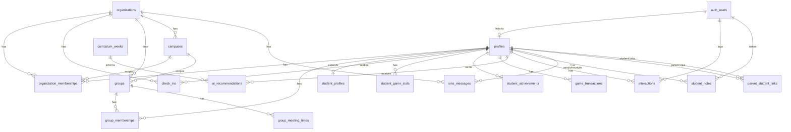

# Database Schema

Supabase PostgreSQL database schema for Sheepdoggo.

## Overview

Multi-tenant PostgreSQL database with Row Level Security (RLS). All tables use UUID primary keys and timestamp tracking.

## Entity Relationship Diagram



---

## Core Tables

### `organizations`

Multi-tenant organization (ministry) records.

| Column | Type | Description |
|--------|------|-------------|
| `id` | uuid | Primary key |
| `name` | text | Organization name |
| `slug` | text | URL slug (unique) |
| `display_name` | text | Display name |
| `short_code` | text | SMS routing code |
| `owner_email` | text | Primary contact |
| `timezone` | text | Timezone (default: America/Chicago) |
| `status` | text | 'active', 'suspended', etc. |
| `created_at` | timestamptz | Creation timestamp |

### `organization_members` ⚠️ DEPRECATED

**Note:** This table is being replaced by `organization_memberships` in the Identity Tables section. Dual-write is enabled during migration. Will be removed in Phase 5.

Organization membership and roles.

| Column | Type | Description |
|--------|------|-------------|
| `member_id` | uuid | Primary key |
| `organization_id` | uuid | FK to organizations |
| `user_id` | uuid | FK to auth.users |
| `email` | text | Member email |
| `role` | text | 'owner', 'admin', 'leader', 'viewer' |
| `status` | text | 'pending', 'active', 'suspended' |
| `invited_at` | timestamptz | Invitation timestamp |
| `accepted_at` | timestamptz | Acceptance timestamp |

### `students` ⚠️ DEPRECATED

**Note:** This table is being replaced by `profiles` + `student_profiles` in the Identity Tables section. Dual-write is enabled during migration. Will be removed in Phase 5.

Student records with contact and profile data.

| Column | Type | Description |
|--------|------|-------------|
| `id` | uuid | Primary key |
| `organization_id` | uuid | FK to organizations |
| `first_name` | text | First name (required) |
| `last_name` | text | Last name |
| `phone_number` | text | Primary phone (searchable) |
| `email` | text | Email address |
| `grade` | text | Grade level ('6'-'12', 'Adult') |
| `high_school` | text | School name |
| `parent_name` | text | Parent/guardian name |
| `parent_phone` | text | Parent phone |
| `profile_pin` | text | 4-digit PIN for profile |
| `user_type` | text | 'student' or 'student_leader' |
| `date_of_birth` | date | Birth date |
| `created_at` | timestamptz | Creation timestamp |

**Indexes:**
- GIN trigram on `phone_number` for fuzzy search
- GIN trigram on `first_name`, `last_name` for name search

### `check_ins`

Daily check-in records (idempotent per day).

| Column | Type | Description |
|--------|------|-------------|
| `id` | uuid | Primary key |
| `profile_id` | uuid | FK to profiles |
| `organization_id` | uuid | FK to organizations |
| `checked_in_at` | timestamptz | Check-in timestamp |
| `created_at` | timestamptz | Record creation |

**Constraints:**
- UNIQUE on `(profile_id, DATE(checked_in_at))` — one check-in per day

---

## Identity Tables

The unified profiles system provides a single identity for every person in the platform.

### `profiles`

Core identity table — one record per human. Can be a student, team member, or both.

| Column | Type | Description |
|--------|------|-------------|
| `id` | uuid | Primary key |
| `first_name` | text | Required |
| `last_name` | text | Required |
| `email` | text | Unique across platform |
| `phone_number` | text | Unique, E.164 format |
| `date_of_birth` | date | Optional |
| `user_id` | uuid | FK to auth.users (nullable) |
| `created_at` | timestamptz | Record creation |
| `updated_at` | timestamptz | Last modification |

**Key principle:** ONE profile per person. An admin who is also a group member uses the SAME profile.

### `organization_memberships`

Defines what role a profile has in each organization.

| Column | Type | Description |
|--------|------|-------------|
| `id` | uuid | Primary key |
| `profile_id` | uuid | FK to profiles |
| `organization_id` | uuid | FK to organizations |
| `role` | text | owner, admin, leader, viewer, student, guardian |
| `status` | text | active, pending, suspended, archived |
| `campus_id` | uuid | FK to campuses (nullable - NULL = all campuses) |
| `created_at` | timestamptz | When joined |
| `updated_at` | timestamptz | Last modification |

**Constraint:** UNIQUE on `(profile_id, organization_id)`

**Roles:**
| Role | Description |
|------|-------------|
| owner | Org owner with billing access |
| admin | Full admin access, can manage all data (within campus scope if set) |
| leader | Can manage their groups and check-in |
| viewer | Read-only access to dashboards |
| student | Students who check in and participate |
| guardian | Non-attending parents who receive communications and view linked children |

### `parent_student_links`

Links guardian profiles to student profiles (family relationships).

| Column | Type | Description |
|--------|------|-------------|
| `id` | uuid | Primary key |
| `parent_profile_id` | uuid | FK to profiles (guardian) |
| `student_profile_id` | uuid | FK to profiles (student) |
| `relationship` | text | father, mother, guardian, other |
| `is_primary` | boolean | Whether this is the primary contact for this student |
| `created_at` | timestamptz | When link was created |
| `created_by` | uuid | FK to auth.users (who created the link) |

**Constraint:** UNIQUE on `(parent_profile_id, student_profile_id)`

### `group_memberships`

Defines participation in groups (replaces both group_members and group_leaders).

| Column | Type | Description |
|--------|------|-------------|
| `id` | uuid | Primary key |
| `profile_id` | uuid | FK to profiles |
| `group_id` | uuid | FK to groups |
| `role` | text | leader, member |
| `is_primary` | boolean | Primary leader designation |
| `joined_at` | timestamptz | When joined |

**Constraint:** UNIQUE on `(profile_id, group_id)`

### `student_profiles`

Optional extension for student-specific data. Only created for profiles with role='student'.

| Column | Type | Description |
|--------|------|-------------|
| `profile_id` | uuid | PK, FK to profiles |
| `grade` | text | Grade level (6-12, Adult) |
| `high_school` | text | School name |
| `profile_pin` | text | 4-digit PIN for kiosk access |
| `instagram_handle` | text | Social handle |
| `address` | text | Street address |
| `city` | text | City |
| `state` | text | State |
| `zip` | text | ZIP code |
| `father_first_name` | text | Father's first name |
| `father_last_name` | text | Father's last name |
| `father_phone` | text | Father's phone |
| `father_email` | text | Father's email |
| `mother_first_name` | text | Mother's first name |
| `mother_last_name` | text | Mother's last name |
| `mother_phone` | text | Mother's phone |
| `mother_email` | text | Mother's email |
| `parent_name` | text | Legacy: guardian name |
| `parent_phone` | text | Legacy: guardian phone |

---

## Gamification Tables

### `student_game_stats`

Cumulative gamification stats per profile.

| Column | Type | Description |
|--------|------|-------------|
| `id` | uuid | Primary key |
| `profile_id` | uuid | FK to profiles (unique) |
| `total_points` | integer | Lifetime points (default: 0) |
| `current_rank` | text | Current rank title |
| `last_points_update` | timestamptz | Last update |

**Rank Tiers:**
| Points | Rank |
|--------|------|
| 0-99 | Newcomer |
| 100-299 | Regular |
| 300-599 | Committed |
| 600-999 | Devoted |
| 1000-1999 | Champion |
| 2000+ | Legend |

### `student_achievements`

Earned achievements.

| Column | Type | Description |
|--------|------|-------------|
| `id` | uuid | Primary key |
| `profile_id` | uuid | FK to profiles |
| `achievement_id` | text | Achievement identifier |
| `achievement_title` | text | Display name |
| `achievement_description` | text | Description |
| `achievement_emoji` | text | Icon/emoji |
| `points_awarded` | integer | Points given |
| `rarity` | text | 'common', 'rare', 'epic', 'legendary' |
| `unlocked_at` | timestamptz | When earned |

**Constraint:** UNIQUE on `(profile_id, achievement_id)`

### `game_transactions`

Audit trail of point transactions.

| Column | Type | Description |
|--------|------|-------------|
| `id` | uuid | Primary key |
| `profile_id` | uuid | FK to profiles |
| `check_in_id` | uuid | FK to check_ins (nullable) |
| `points_earned` | integer | Points awarded |
| `transaction_type` | text | Type (see below) |
| `description` | text | Explanation |
| `metadata` | jsonb | Additional context |
| `created_at` | timestamptz | Transaction time |

**Transaction Types:**
- `base_checkin` — Standard check-in points
- `streak_bonus` — Consecutive week bonus
- `achievement` — Achievement unlock bonus
- `first_time` — First check-in bonus
- `early_bird_bonus` — Early arrival
- `dedication_bonus` — Multiple check-ins same week
- `weekend_warrior_bonus` — Sunday attendance
- `midweek_hero_bonus` — Wednesday attendance
- `student_leader_bonus` — Leader role bonus

---

## Pastoral Care Tables

### `curriculum_weeks`

Weekly teaching curriculum for AI context.

| Column | Type | Description |
|--------|------|-------------|
| `id` | uuid | Primary key |
| `week_date` | date | Week start date |
| `series_name` | text | Teaching series name |
| `topic_title` | text | This week's topic |
| `main_scripture` | text | Primary Bible passage |
| `big_idea` | text | One-sentence takeaway |
| `key_biblical_principle` | text | Core truth |
| `application_challenge` | text | Practical application |
| `core_truths` | text[] | Array of key truths |
| `faith_skills` | text[] | 'Hear', 'Pray', 'Talk', 'Live' |
| `target_phases` | text[] | Grade levels ('6'-'12') |
| `phase_relevance` | jsonb | Phase-specific relevance |
| `discussion_questions` | jsonb | Phase-specific questions |
| `is_current` | boolean | Active week flag (only one) |

### `ai_recommendations`

AI-generated pastoral recommendations.

| Column | Type | Description |
|--------|------|-------------|
| `id` | uuid | Primary key |
| `profile_id` | uuid | FK to profiles |
| `curriculum_week_id` | uuid | FK to curriculum_weeks |
| `key_insight` | text | One-sentence insight (max 120 chars) |
| `action_bullets` | text[] | 3 action items |
| `context_paragraph` | text | 2-4 sentence explanation |
| `engagement_status` | text | Belonging status at generation |
| `days_since_last_seen` | integer | Days since check-in |
| `status` | text | 'pending', 'accepted', 'completed', 'dismissed' |
| `assigned_to` | uuid | FK to auth.users |
| `is_dismissed` | boolean | Whether dismissed |
| `generated_at` | timestamptz | Generation timestamp |

**Constraint:** UNIQUE on `(profile_id, curriculum_week_id)`

### `student_profiles_extended`

Extended profile for richer AI context.

| Column | Type | Description |
|--------|------|-------------|
| `profile_id` | uuid | PK, FK to profiles |
| `current_phase` | text | Phase name |
| `spiritual_maturity` | text | 'Exploring', 'Growing', 'Strong Believer', 'Leadership Ready' |
| `faith_background` | text | 'New to faith', 'Churched', 'Unchurched', 'Unknown' |
| `interests` | text[] | Hobbies and interests |
| `learning_style` | text | 'Visual', 'Auditory', 'Kinesthetic', etc. |
| `current_challenges` | text[] | Current struggles |
| `family_context` | text | Family situation |
| `gender` | text | 'Male', 'Female', etc. |

### `interactions`

Pastoral outreach records.

| Column | Type | Description |
|--------|------|-------------|
| `id` | uuid | Primary key |
| `profile_id` | uuid | FK to profiles |
| `leader_id` | uuid | FK to auth.users |
| `leader_name` | text | Denormalized name |
| `interaction_type` | text | 'text', 'call', 'in_person', etc. |
| `status` | text | 'pending', 'completed', 'no_response' |
| `content` | text | What was communicated |
| `outcome` | text | Result |
| `recommendation_id` | uuid | FK to ai_recommendations |
| `follow_up_date` | date | Follow-up reminder |
| `created_at` | timestamptz | Timestamp |

### `student_notes`

Persistent context notes about profiles.

| Column | Type | Description |
|--------|------|-------------|
| `id` | uuid | Primary key |
| `profile_id` | uuid | FK to profiles |
| `leader_id` | uuid | FK to auth.users |
| `leader_name` | text | Denormalized name |
| `content` | text | Note content |
| `is_pinned` | boolean | Show at top |
| `created_at` | timestamptz | Timestamp |

---

## Groups Tables

### `groups`

Student groups (MS Boys, HS Girls, etc.).

| Column | Type | Description |
|--------|------|-------------|
| `id` | uuid | Primary key |
| `organization_id` | uuid | FK to organizations |
| `name` | text | Group name |
| `short_code` | text | SMS routing code |
| `color` | text | Display color |
| `is_active` | boolean | Active flag |
| `created_at` | timestamptz | Timestamp |

### `group_meeting_times`

Meeting schedule per group.

| Column | Type | Description |
|--------|------|-------------|
| `id` | uuid | Primary key |
| `group_id` | uuid | FK to groups |
| `day_of_week` | integer | 0-6 (Sunday-Saturday) |
| `start_time` | time | Meeting start |
| `end_time` | time | Meeting end |

**Note:** Group membership (both members and leaders) is now managed via the `group_memberships` table in the Identity Tables section.

---

## SMS Tables

### `sms_messages`

SMS message records.

| Column | Type | Description |
|--------|------|-------------|
| `id` | uuid | Primary key |
| `organization_id` | uuid | FK to organizations |
| `profile_id` | uuid | FK to profiles (nullable) |
| `direction` | text | 'inbound' or 'outbound' |
| `body` | text | Message content |
| `from_number` | text | Sender phone |
| `to_number` | text | Recipient phone |
| `twilio_sid` | text | Twilio message ID |
| `status` | text | 'sent', 'delivered', 'failed', 'received' |
| `sent_by` | uuid | FK to auth.users (for outbound) |
| `created_at` | timestamptz | Timestamp |

### `sms_sessions`

Active SMS conversation sessions for routing.

| Column | Type | Description |
|--------|------|-------------|
| `id` | uuid | Primary key |
| `phone_number` | text | Phone number |
| `organization_id` | uuid | FK to organizations |
| `group_id` | uuid | FK to groups (nullable) |
| `status` | text | 'pending_group', 'active' |
| `started_at` | timestamptz | Session start |

---

## RLS Security Model

All tables use Row Level Security with helper functions to prevent recursion.

### Helper Functions (SECURITY DEFINER)

```sql
-- Check super admin status
auth_is_super_admin(user_id UUID) → BOOLEAN

-- Get user's organization IDs (legacy, via organization_members)
auth_user_org_ids(user_id UUID) → SETOF UUID

-- Get user's organization IDs via profiles system
auth_profile_org_ids(user_id UUID) → UUID[]

-- Check org role membership
auth_has_org_role(org_id UUID, roles TEXT[]) → BOOLEAN
```

### Policy Patterns

**Super admin access:**
```sql
CREATE POLICY "super_admin_all" ON table_name
USING (auth_is_super_admin(auth.uid()));
```

**Organization member access:**
```sql
CREATE POLICY "org_member_view" ON students FOR SELECT
USING (organization_id IN (SELECT auth_user_org_ids(auth.uid())));
```

---

## Key RPC Functions

### Check-in Functions

| Function | Purpose |
|----------|---------|
| `search_student_for_checkin(term)` | Fuzzy search profiles + student_profiles by phone/name |
| `checkin_student(profile_id)` | Idempotent daily check-in |
| `register_student_and_checkin(...)` | Creates profile → student_profile → org_membership → check_in |

### Gamification Functions

| Function | Purpose |
|----------|---------|
| `get_student_game_profile(profile_id)` | Complete game profile |
| `award_points(...)` | Award points with transaction |
| `unlock_achievement(...)` | Unlock achievement |
| `process_checkin_rewards(...)` | Calculate check-in rewards |

### Pastoral Functions

| Function | Purpose |
|----------|---------|
| `get_pastoral_analytics()` | Engagement analytics for all profiles |
| `get_student_context(profile_id)` | Notes + interactions |
| `log_interaction(...)` | Record pastoral outreach |
| `accept_recommendation(id)` | Accept AI recommendation |
| `get_my_queue()` | Current leader's pending tasks |

### Organization Functions

| Function | Purpose |
|----------|---------|
| `get_user_organizations(user_id)` | User's orgs via profile → organization_memberships |
| `get_organization_members(org_id)` | Returns organization_memberships + profiles |
| `accept_pending_invitations(user_id, email, display_name)` | Creates profile + organization_membership |
| `get_all_organizations()` | Super admin: all orgs |
| `create_organization(...)` | Super admin: create org |
| `is_super_admin(user_id)` | Check admin status |
| `super_admin_join_organization(org_id, role)` | Super admin: join any org with specified role |

### Group Functions

| Function | Purpose |
|----------|---------|
| `get_group_members(group_id)` | Returns group_memberships + profiles |
| `add_group_member(profile_id, group_id, role)` | Creates group_membership |
| `get_student_group_streak(profile_id, group_id)` | Per-group streak calculation |

### People & Guardian Functions

| Function | Purpose |
|----------|---------|
| `get_organization_people(org_id, role_filter, campus_id, include_archived)` | Unified people list with filters |
| `get_parent_children(parent_profile_id, org_id)` | Get children linked to a guardian |
| `get_student_parents(student_profile_id, org_id)` | Get parents linked to a student |
| `link_parent_to_student(parent_id, student_id, relationship, is_primary)` | Create parent-student link |
| `unlink_parent_from_student(parent_id, student_id)` | Remove parent-student link |
| `create_guardian_profiles_from_student(student_id, org_id, campus_id)` | Auto-create guardian profiles from student_profiles data |
| `invite_guardian_to_claim(guardian_id, org_id, invited_by)` | Create invitation for guardian to claim profile |
| `accept_invitation_and_claim_profile(token, user_id, display_name)` | Claim existing profile via invitation |

---

## Belonging Status Logic

The `get_pastoral_analytics()` function calculates engagement tiers:

```
Ultra-Core: 5+ check-ins in last 4 weeks
Core:       4+ check-ins in 8 weeks (~1x/week)
Connected:  2-3 check-ins in 8 weeks
On the Fringe: Seen recently but inconsistent, or 30-60 days absent
Missing:    60+ days absent OR never checked in
```

Returns attendance pattern as JSONB array:
```json
[
  { "week_start": "2024-09-01", "days_attended": 2 },
  { "week_start": "2024-09-08", "days_attended": 0 },
  ...
]
```

---

## Design Decisions

| Decision | Rationale |
|----------|-----------|
| **Idempotent check-ins** | UNIQUE constraint prevents duplicates; simplifies app logic |
| **Denormalized names** | `leader_name` columns survive user deletions |
| **Soft delete recommendations** | History tracking for audit trail |
| **Separate stats table** | `student_game_stats` separates gamification from identity |
| **SECURITY DEFINER helpers** | Prevent RLS recursion issues |
| **JSONB for flexible data** | `metadata`, `phase_relevance`, `discussion_questions` |
