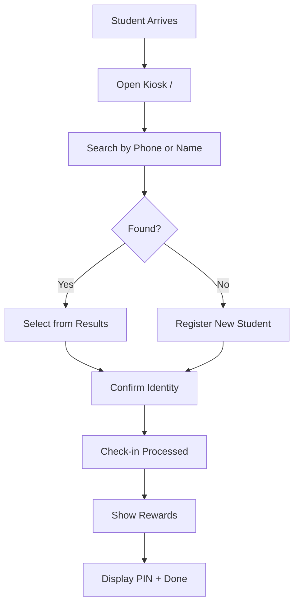

# Check-in System

JRPG-themed public kiosk for student check-ins.

## Overview

The check-in system is a public-facing kiosk that allows students to check themselves in when they arrive. It features a JRPG (Japanese Role-Playing Game) visual theme with pixel art styling, making the check-in process fun and engaging for students.

## Status

🟢 **Complete**

## User Flow

## Key Components

| Component | Path | Purpose |
|-----------|------|---------|
| `CheckInPage` | `src/app/(public)/page.tsx` | Main kiosk page |
| `StudentSearch` | `src/components/checkin/StudentSearch.tsx` | Fuzzy search input |
| `StudentCard` | `src/components/checkin/StudentCard.tsx` | Search result display |
| `CheckInConfirmation` | `src/components/checkin/CheckInConfirmation.tsx` | Identity confirmation |
| `RewardsDisplay` | `src/components/checkin/RewardsDisplay.tsx` | Points and achievements |
| `RegistrationForm` | `src/components/checkin/RegistrationForm.tsx` | New student form |

## Database Tables

- `students` — Student records
- `check_ins` — Check-in events (one per day per student)
- `student_game_stats` — Points and rank
- `student_achievements` — Earned achievements
- `game_transactions` — Point transaction log

## RPC Functions

| Function | Purpose |
|----------|---------|
| `search_student_for_checkin(term)` | Fuzzy search by phone/name/email |
| `checkin_student(student_id)` | Create idempotent check-in |
| `register_student_and_checkin(...)` | Register + check-in new student |
| `process_checkin_rewards(student_id, checkin_id)` | Calculate rewards |

## Features

### Fuzzy Search
- Searches phone numbers (with any formatting)
- Searches first and last names
- Searches email addresses
- Uses PostgreSQL trigram similarity
- Returns top 10 matches ranked by relevance

### Idempotent Check-ins
- Database constraint prevents duplicate daily check-ins
- If already checked in today, returns existing check-in
- Frontend shows friendly "already checked in" message

### Profile PINs
- 4-digit PIN generated on first check-in
- Used for profile access (future feature)
- Displayed on completion screen

### New Student Registration
- Minimal required fields: first name, phone, grade
- Optional: last name, email, high school
- Immediately checks in after registration

## JRPG Theme Elements

| Element | Implementation |
|---------|---------------|
| Pixel font | `font-pixel` CSS class |
| Speech bubbles | Card components with pointed borders |
| Level-up animation | Confetti on achievement unlock |
| Character sprites | Future enhancement |
| Sound effects | Future enhancement |

## Configuration

No special configuration required. Works on any device with a browser.

**Recommended setup:**
- Dedicated tablet or kiosk device
- Full-screen browser mode
- Auto-refresh on wake

## Known Issues / Future Plans

- [ ] Add offline mode with sync
- [ ] Add sound effects for rewards
- [ ] Add character sprite selection
- [ ] Add group-specific check-in kiosks
- [ ] Add facial recognition (far future)
