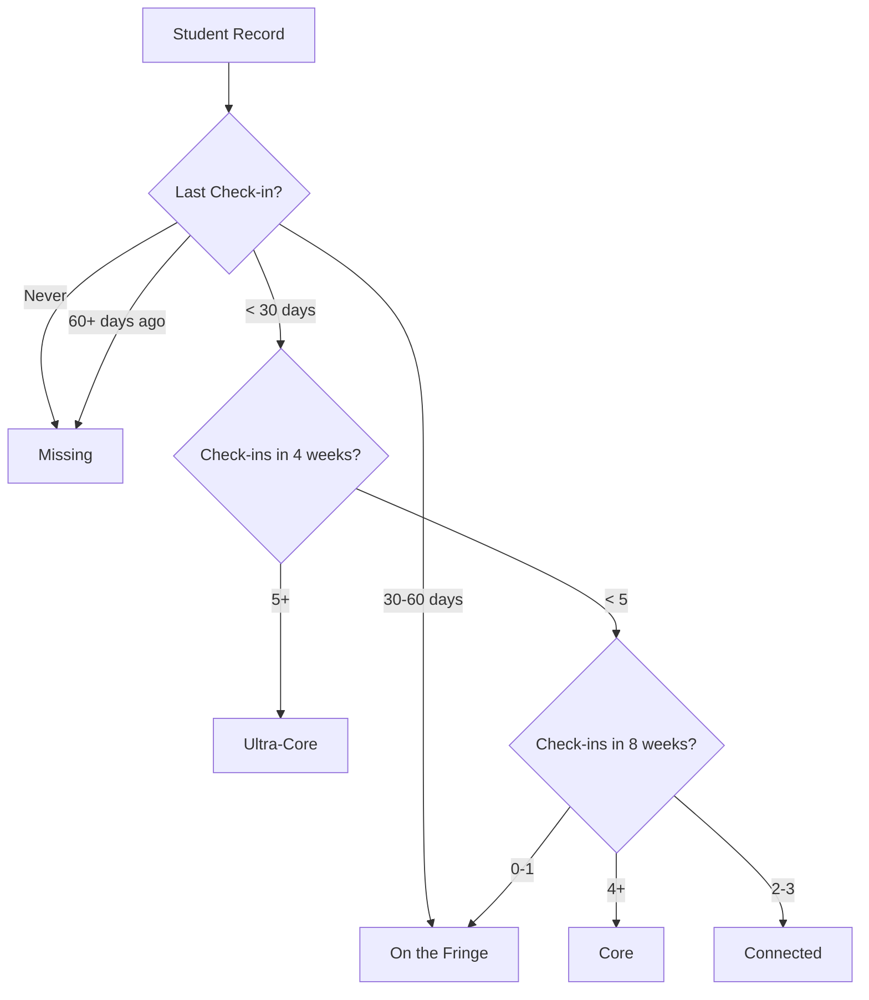

# Belonging Spectrum

Visual engagement classification into 5 tiers.

## Overview

The Belonging Spectrum visualizes student engagement levels across a 5-tier system. It provides at-a-glance understanding of how connected your students are, using a green gradient color scheme where darker green indicates higher engagement.

## Status

🟢 **Complete**

## Classification Logic



## Key Components

| Component | Path | Purpose |
|-----------|------|---------|
| `BelongingSpectrum` | `src/components/pastoral/BelongingSpectrum.tsx` | Horizontal bar visualization |
| `PersonProfileModal` | `src/components/people/PersonProfileModal.tsx` | Status badge in header |
| `PersonPastoralContent` | `src/components/people/PersonPastoralContent.tsx` | Status in pastoral tab |

## Status Definitions

| Status | Color | Criteria |
|--------|-------|----------|
| **Ultra-Core** | `#15803d` (green-700) | 5+ check-ins in last 4 weeks |
| **Core** | `#22c55e` (green-500) | 4+ check-ins in 8 weeks (~1x/week) |
| **Connected** | `#4ade80` (green-400) | 2-3 check-ins in 8 weeks |
| **On the Fringe** | `#86efac` (green-300) | Seen recently but inconsistent, OR 30-60 days absent |
| **Missing** | `#bbf7d0` (green-200) | 60+ days absent OR never checked in |

## Color Design

The green gradient communicates engagement visually:
- **Darker green** = More connected, higher engagement
- **Lighter green** = Less connected, needs attention

This single-hue approach avoids the "alarm" effect of red/yellow colors for the Missing category, which typically contains the largest number of students.

## Bar Chart Visualization

The BelongingSpectrum component displays a horizontal stacked bar:

```
[Ultra-Core][  Core  ][Connected][ On the Fringe ][ Missing ]
   ████████████████████████████████████████████████████████
```

**Features:**
- Proportional width based on student count
- Click any segment to filter student list
- Hover for exact count
- Labels show count inside bar if space permits

## Database Query

The `get_pastoral_analytics()` RPC function calculates belonging status:

```sql
CASE
  WHEN days_since_last_seen IS NULL THEN 'Missing'
  WHEN days_since_last_seen >= 60 THEN 'Missing'
  WHEN days_since_last_seen >= 30 THEN 'On the Fringe'
  WHEN checkins_last_4_weeks >= 5 THEN 'Ultra-Core'
  WHEN checkins_last_8_weeks >= 4 THEN 'Core'
  WHEN checkins_last_8_weeks >= 2 THEN 'Connected'
  ELSE 'On the Fringe'
END as belonging_status
```

## Usage Locations

| Location | Purpose |
|----------|---------|
| Dashboard | Overview bar chart |
| People Directory | Filter by status |
| Student Profile | Badge in header |
| Pastoral Tab | Context for recommendations |
| AI Recommendations | Input for Claude prompt |

## Click-to-Filter Behavior

When clicking a spectrum segment:
1. Filter people list to that status
2. URL updates with query param
3. Back button restores full list

## Attendance Pattern

Each student also has an 8-week attendance pattern:

```json
[
  { "week_start": "2024-09-01", "days_attended": 2 },
  { "week_start": "2024-09-08", "days_attended": 1 },
  { "week_start": "2024-09-15", "days_attended": 0 },
  ...
]
```

Displayed as 8 boxes:
- **Green with check** — Attended that week
- **Gray with X** — Did not attend

## Configuration

No configuration required. Thresholds are defined in the database function.

## Known Issues / Future Plans

- [ ] Configurable thresholds per organization
- [ ] Trend indicators (improving/declining)
- [ ] Group-specific belonging status
- [ ] Historical belonging changes
