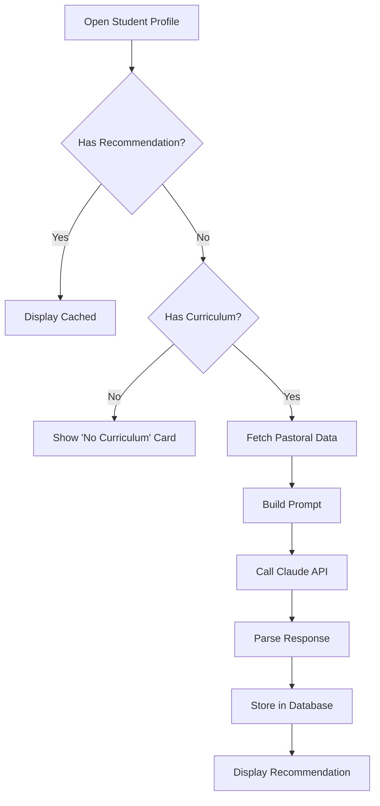
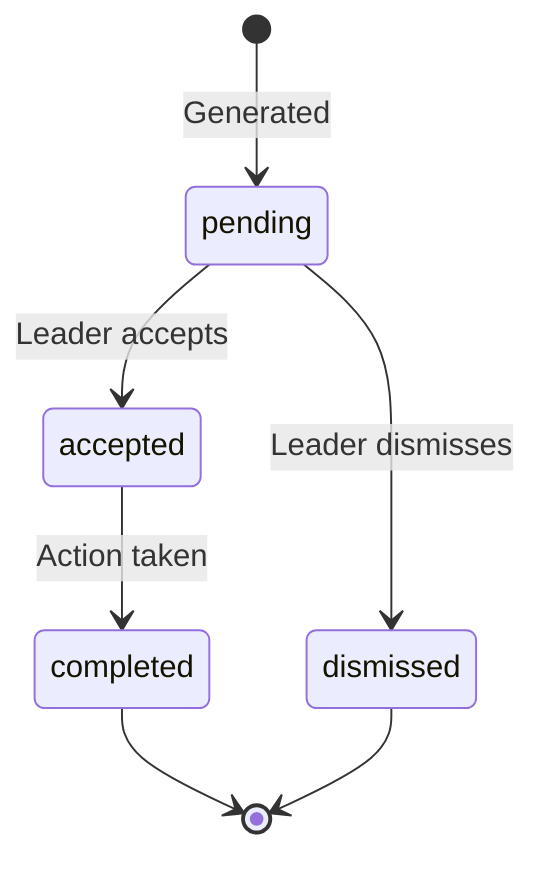

# AI Recommendations

Claude-powered pastoral insights for student care.

## Overview

AI Recommendations uses Anthropic's Claude to generate personalized pastoral care suggestions for each student. Recommendations combine engagement data (belonging status, attendance pattern) with curriculum context (current teaching topic) to provide actionable, phase-appropriate guidance.

## Status

🟢 **Complete**

## Recommendation Flow



## Key Components

| Component | Path | Purpose |
|-----------|------|---------|
| `PersonPastoralContent` | `src/components/people/PersonPastoralContent.tsx` | Pastoral tab with auto-generate |
| `RecommendationDisplay` | `src/components/pastoral/RecommendationDisplay.tsx` | Recommendation card UI |
| `StudentContextPanel` | `src/components/pastoral/workflow/StudentContextPanel.tsx` | Notes + interactions |

## Database Tables

### `ai_recommendations`

| Column | Purpose |
|--------|---------|
| `student_id` | Target student |
| `curriculum_week_id` | Curriculum context |
| `key_insight` | One-sentence insight (max 120 chars) |
| `action_bullets` | 3 action items |
| `context_paragraph` | Explanation paragraph |
| `engagement_status` | Belonging status at generation |
| `status` | pending/accepted/completed/dismissed |

### `curriculum_weeks`

| Column | Purpose |
|--------|---------|
| `topic_title` | Teaching topic |
| `main_scripture` | Bible passage |
| `big_idea` | One-sentence takeaway |
| `application_challenge` | Practical application |
| `phase_relevance` | Grade-specific context |
| `is_current` | Active week flag |

## API Route

**Endpoint:** `POST /api/recommendations/generate`

**Request:**
```typescript
{
  studentId: string;
  pastoralData: StudentPastoralData;
  curriculum: CurriculumWeek;
}
```

**Response:**
```typescript
{
  id: string;
  key_insight: string;
  action_bullets: string[];
  context_paragraph: string;
  engagement_status: string;
  generated_at: string;
}
```

## Prompt Structure

The prompt includes:

1. **Student Context**
   - Name, grade, phase description
   - Belonging status (Ultra-Core → Missing)
   - Days since last seen
   - 8-week attendance pattern

2. **Curriculum Context**
   - Topic title and scripture
   - Big idea and application
   - Phase-specific relevance

3. **Output Format**
   - Key Insight (max 120 chars)
   - 3 Action Bullets (specific, actionable)
   - Context Paragraph (2-4 sentences)

## Phase-Specific Guidance

Recommendations are tailored by grade:

| Grade | Phase | Focus |
|-------|-------|-------|
| 6 | Who Cares | Building trust, belonging |
| 7 | Big Deal | Identity formation |
| 8 | Changing Everything | Transition support |
| 9 | Finding My Place | New environment navigation |
| 10 | Half & Half | Balance and choices |
| 11 | Almost There | Future preparation |
| 12 | Moving On | Transition to adulthood |

## Generation Triggers

| Trigger | Method |
|---------|--------|
| View pastoral tab | Auto-generate if missing |
| Batch job | Edge Function (scheduled) |
| Manual refresh | Retry button on error |

## Recommendation Lifecycle



## React Query Integration

```typescript
// Hook for fetching existing recommendation
const { data: recommendation } = useStudentRecommendation(studentId);

// Hook for current curriculum
const { data: curriculum } = useCurrentCurriculum();

// Mutation for generating new recommendation
const { mutate, isPending } = useGenerateRecommendation();
```

## Auto-Generation Logic

In `PersonPastoralContent.tsx`:

```typescript
useEffect(() => {
  if (
    pastoralData &&
    curriculum &&
    !existingRecommendation &&
    !recommendationLoading &&
    !isGeneratePending &&
    !isGenerateError
  ) {
    mutate({ studentId, pastoralData, curriculum });
  }
}, [/* dependencies */]);
```

## Error Handling

| Error | UI Response |
|-------|-------------|
| No API key | Server error, log warning |
| API rate limit | Show error card with retry |
| No curriculum | Show "Set curriculum" card |
| Parse error | Fall back to raw response |

## Configuration

**Required:**
- `ANTHROPIC_API_KEY` environment variable
- Current curriculum week set in database

## Known Issues / Future Plans

- [ ] Batch generation Edge Function
- [ ] Recommendation history view
- [ ] Feedback on recommendation quality
- [ ] Fine-tune prompt based on feedback
- [ ] Integration with prayer requests (Seedling.so)
