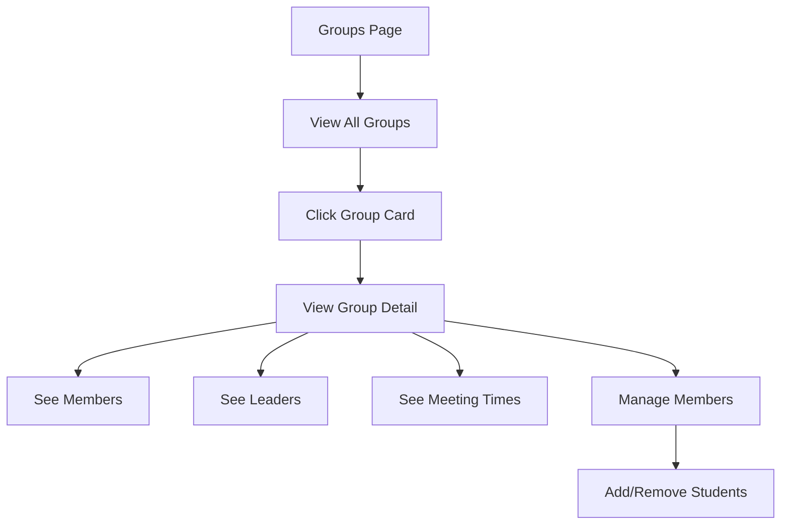

# Groups

Student groups with leaders and meeting schedules.

## Overview

Groups allow organizing students into logical segments (e.g., MS Boys, HS Girls, Small Groups). Each group can have assigned leaders, meeting schedules, and is used for SMS routing and attendance tracking.

## Status

🟢 **Complete**

## User Flow



## Key Components

| Component | Path | Purpose |
|-----------|------|---------|
| `GroupsPage` | `src/app/(protected)/[org]/groups/page.tsx` | Groups list view |
| `GroupCard` | `src/components/groups/GroupCard.tsx` | Group summary card |
| `GroupDetailModal` | `src/components/groups/GroupDetailModal.tsx` | Full group details |
| `MemberManagement` | `src/components/groups/MemberManagement.tsx` | Add/remove members |
| `LeaderAssignment` | `src/components/groups/LeaderAssignment.tsx` | Assign leaders |

## Database Tables

### `groups`

| Column | Type | Purpose |
|--------|------|---------|
| `id` | uuid | Primary key |
| `organization_id` | uuid | Parent organization |
| `name` | text | Group name |
| `short_code` | text | SMS routing code |
| `color` | text | Display color (hex) |
| `is_active` | boolean | Active flag |
| `created_at` | timestamptz | Creation time |

### `group_members`

| Column | Type | Purpose |
|--------|------|---------|
| `id` | uuid | Primary key |
| `group_id` | uuid | FK to groups |
| `student_id` | uuid | FK to students |
| `joined_at` | timestamptz | Join date |

### `group_leaders`

| Column | Type | Purpose |
|--------|------|---------|
| `id` | uuid | Primary key |
| `group_id` | uuid | FK to groups |
| `user_id` | uuid | FK to auth.users |
| `is_primary` | boolean | Primary leader flag |

### `group_meeting_times`

| Column | Type | Purpose |
|--------|------|---------|
| `id` | uuid | Primary key |
| `group_id` | uuid | FK to groups |
| `day_of_week` | integer | 0-6 (Sun-Sat) |
| `start_time` | time | Meeting start |
| `end_time` | time | Meeting end |

## Features

### Group Cards
- Display member count
- Show assigned leaders
- Color-coded border
- Quick actions (view, edit)

### Member Management
- Search students to add
- Bulk add by grade
- Remove members
- View member details

### Leader Assignment
- Assign team members as leaders
- Mark primary leader
- Leaders receive SMS for their groups

### Meeting Schedule
- Multiple meeting times per group
- Day and time display
- Used for attendance context

### SMS Routing
- Groups have short codes
- Inbound SMS routes to group leaders
- Students belong to groups for routing

## Hooks

```typescript
// Fetch all groups for organization
const { data: groups } = useGroups(orgId);

// Fetch single group details
const { data: group } = useGroup(groupId);

// Fetch group members
const { data: members } = useGroupMembers(groupId);
```

## RPC Functions

| Function | Purpose |
|----------|---------|
| `get_student_group_streak(student_id, group_id)` | Per-group attendance streak |
| `list_org_groups_for_sms(org_id)` | Active groups for SMS menu |
| `find_student_groups(phone)` | Groups a student belongs to |

## Configuration

Groups are created through the UI:
1. Navigate to Groups page
2. Click "Add Group"
3. Enter name, color, short code
4. Save

## Known Issues / Future Plans

- [ ] Group-specific check-in kiosk
- [ ] Group attendance reports
- [ ] Group messaging (broadcast to all members)
- [ ] Sub-groups (small groups within large groups)
- [ ] Campus support (groups per campus)
