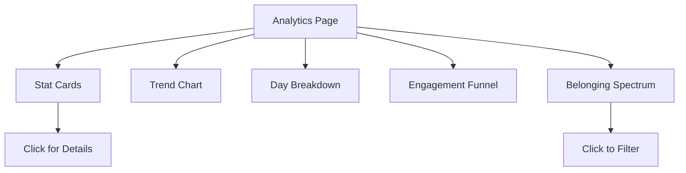

# Analytics

Charts, trends, and engagement reports.

## Overview

The Analytics feature provides visual insights into ministry engagement through stat cards, trend charts, attendance breakdowns, and the engagement funnel. It helps leaders understand patterns and make data-driven decisions.

## Status

🟢 **Complete**

## Dashboard View



## Key Components

| Component | Path | Purpose |
|-----------|------|---------|
| `AnalyticsPage` | `src/app/(protected)/[org]/analytics/page.tsx` | Main analytics view |
| `StatCard` | `src/components/analytics/StatCard.tsx` | Metric display card |
| `AttendanceTrendChart` | `src/components/analytics/AttendanceTrendChart.tsx` | Line chart over time |
| `DayBreakdownChart` | `src/components/analytics/DayBreakdownChart.tsx` | Bar chart by day |
| `EngagementFunnel` | `src/components/analytics/EngagementFunnel.tsx` | Funnel visualization |
| `BelongingSpectrum` | `src/components/pastoral/BelongingSpectrum.tsx` | Status distribution |
| `Leaderboard` | `src/components/analytics/Leaderboard.tsx` | Top students by points |

## Stat Cards

| Metric | Description |
|--------|-------------|
| **Total Students** | All students in organization |
| **Check-ins Today** | Today's attendance count (clickable) |
| **Active This Week** | Students who checked in this week |
| **New This Month** | Students created this month |

### Clickable Stat Cards

"Check-ins Today" opens the TodaysCheckInsModal showing:
- Student name
- Check-in time
- Grade
- Click to view profile

## Trend Charts

### Attendance Trend
- **Type:** Line chart
- **Data:** Daily/weekly check-in counts
- **Period:** Last 8 weeks (configurable)
- **Comparison:** Optional previous period overlay

### Day Breakdown
- **Type:** Bar chart
- **Data:** Check-ins by day of week
- **Purpose:** Identify attendance patterns (Wed vs Sun)

## Engagement Funnel

Visualizes student journey through engagement tiers:

```
Total Students:    ████████████████████████████████████  250
Active (8 weeks):  ██████████████████████████           180
Core:              ███████████████                       120
Ultra-Core:        ████████                               60
```

## Belonging Spectrum

Horizontal stacked bar showing distribution:

| Status | Typical % |
|--------|-----------|
| Ultra-Core | 10-15% |
| Core | 20-30% |
| Connected | 15-25% |
| On the Fringe | 10-20% |
| Missing | 30-40% |

**Interactive:** Click any segment to filter student list.

## Date Range Filtering

Select time period for analysis:
- Last 7 days
- Last 30 days
- Last 8 weeks
- Custom range

## Data Sources

### RPC Functions

| Function | Purpose |
|----------|---------|
| `get_pastoral_analytics()` | Complete engagement data |
| `get_attendance_trend(start, end)` | Daily check-in counts |
| `get_day_breakdown(start, end)` | By day of week |

### Query Hooks

```typescript
// Dashboard stats
const { data: stats } = useDashboardStats(orgId);

// Attendance trend
const { data: trend } = useAttendanceTrend(orgId, startDate, endDate);

// Pastoral analytics
const { data: pastoral } = usePastoralAnalytics(orgId);
```

## Charts Library

Using **Recharts** for visualizations:

```typescript
import { LineChart, Line, BarChart, Bar, XAxis, YAxis, Tooltip } from 'recharts';

<LineChart data={trendData}>
  <XAxis dataKey="date" />
  <YAxis />
  <Tooltip />
  <Line type="monotone" dataKey="count" stroke="#22c55e" />
</LineChart>
```

## CSV Export

**Planned feature:** Export analytics data to CSV.

Exportable data:
- Attendance by date
- Student engagement status
- Check-in history

## Configuration

No special configuration. All metrics calculate from check_ins and students tables.

## Performance Considerations

- Cached with TanStack Query (5-minute stale time)
- Pagination for large datasets
- Consider materialized views for 1000+ students

## Known Issues / Future Plans

- [ ] CSV export functionality
- [ ] Custom date range picker
- [ ] Comparison periods (this month vs last)
- [ ] Drill-down from charts to students
- [ ] Email/Slack weekly digest
- [ ] Goal tracking (attendance targets)
