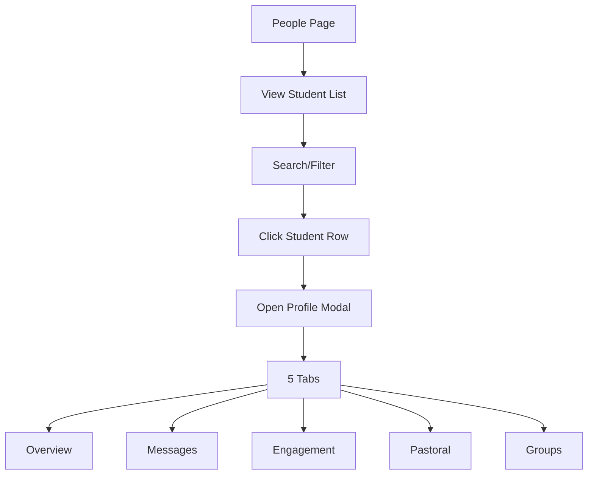

# People Directory

Searchable student profiles with multi-filter support.

## Overview

The People Directory is the central hub for viewing and managing student information. It provides a searchable, filterable list of all students with quick access to detailed profiles, contact actions, and pastoral insights.

## Status

🟢 **Complete**

## User Flow



## Key Components

| Component | Path | Purpose |
|-----------|------|---------|
| `PeoplePage` | `src/app/(protected)/[org]/people/page.tsx` | Directory page |
| `StudentTable` | `src/components/people/StudentTable.tsx` | Sortable table |
| `PersonProfileModal` | `src/components/people/PersonProfileModal.tsx` | Profile modal |
| `PersonPastoralContent` | `src/components/people/PersonPastoralContent.tsx` | Pastoral tab |
| `FilterBar` | `src/components/people/FilterBar.tsx` | Search and filters |

## Profile Modal Tabs

### Overview Tab
- Contact info (phone, email)
- School and grade
- Last check-in date
- Group memberships
- Quick actions

### Messages Tab
- SMS conversation thread
- Message composer
- Requires phone number

### Engagement Tab
- Total points
- Current rank
- Total check-ins
- Achievement highlights
- Streak status

### Pastoral Tab
- 8-week attendance pattern
- Belonging status badge
- AI recommendation (auto-generated)
- Recent interactions
- Student notes
- Quick contact actions

### Groups Tab
- Groups student belongs to
- Join date per group
- Add to group button

## Filters

| Filter | Options |
|--------|---------|
| **Search** | Name, phone, email |
| **Grade** | 6, 7, 8, 9, 10, 11, 12, Adult |
| **Group** | Any org group |
| **Status** | Ultra-Core, Core, Connected, Fringe, Missing |

Multiple filters combine with AND logic.

## Database Tables

### `students`

| Column | Display |
|--------|---------|
| `first_name`, `last_name` | Full name |
| `phone_number` | Contact |
| `email` | Contact |
| `grade` | Grade column |
| `high_school` | School info |

### Computed from `get_pastoral_analytics()`

| Field | Display |
|-------|---------|
| `belonging_status` | Status badge |
| `days_since_last_seen` | "Last seen" |
| `total_checkins_8weeks` | Engagement indicator |

## Hooks

```typescript
// All students with pastoral data
const { data: students } = useStudents(orgId);

// Single student detail
const { data: student } = useStudent(studentId);

// Pastoral data for profile
const { data: pastoral } = useStudentPastoralData(studentId);
```

## Table Features

### Sorting
Click column headers to sort:
- Name (A-Z, Z-A)
- Grade (ascending, descending)
- Last seen (recent first)
- Points (highest first)

### Pagination
- 25 students per page
- Page navigation
- Total count display

### Row Actions
- Click row → Open profile
- Quick call button
- Quick text button

## Quick Actions

| Action | Trigger | Result |
|--------|---------|--------|
| Call | Click phone icon | Opens tel: link |
| Text | Click message icon | Opens Messages tab |
| View | Click row | Opens Overview tab |

## Search Behavior

- Debounced (300ms delay)
- Searches: first name, last name, phone, email
- Case-insensitive
- Partial matches

## Belonging Status Integration

Status badge in profile header:
```typescript
const belongingStatusColors = {
  'Ultra-Core': 'bg-green-700 text-white',
  'Core': 'bg-green-500 text-white',
  'Connected': 'bg-green-400 text-gray-800',
  'On the Fringe': 'bg-green-300 text-gray-800',
  'Missing': 'bg-green-200 text-gray-600',
};
```

## Configuration

No special configuration. Student data comes from database.

## Known Issues / Future Plans

- [ ] Bulk actions (message multiple students)
- [ ] Export to CSV
- [ ] Student merge (combine duplicates)
- [ ] Photo/avatar support
- [ ] Custom fields per organization
- [ ] Tags system for flexible categorization
