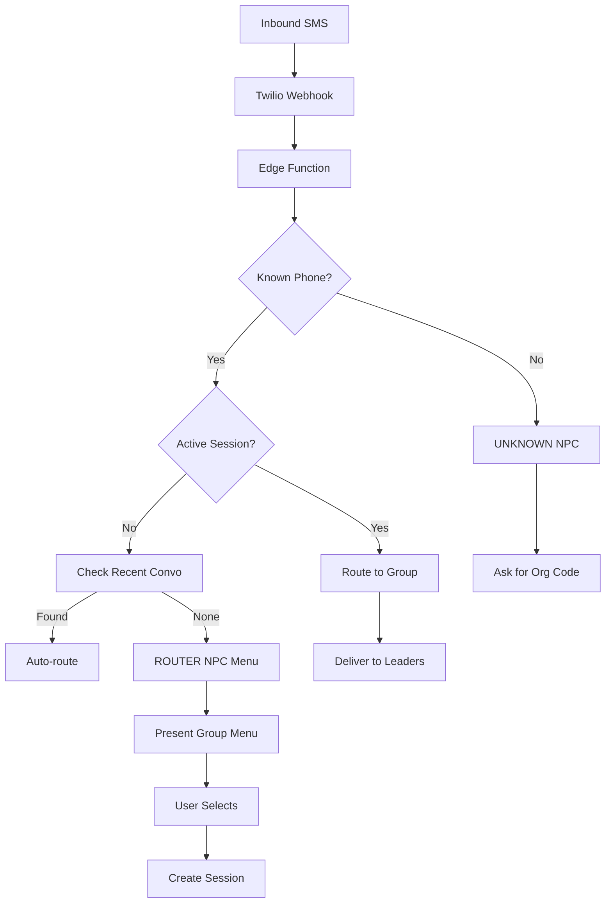

# SMS Messaging

Two-way texting with Twilio integration.

## Overview

SMS Messaging enables two-way text communication between ministry leaders and students. It includes conversation threads, session-based routing, and an NPC router that directs messages to the appropriate group leaders.

## Status

🟡 **In Progress** — Core messaging works, NPC router needs completion

## SMS Flow



## Key Components

| Component | Path | Purpose |
|-----------|------|---------|
| `ConversationThread` | `src/components/sms/ConversationThread.tsx` | Message display |
| `MessageComposer` | `src/components/sms/MessageComposer.tsx` | Send messages |
| `SmsWaitingRoom` | `src/components/sms/SmsWaitingRoom.tsx` | Unknown numbers |

## Database Tables

### `sms_messages`

| Column | Type | Purpose |
|--------|------|---------|
| `id` | uuid | Primary key |
| `organization_id` | uuid | Owning organization |
| `student_id` | uuid | Related student (nullable) |
| `direction` | text | 'inbound' or 'outbound' |
| `body` | text | Message content |
| `from_number` | text | Sender phone |
| `to_number` | text | Recipient phone |
| `twilio_sid` | text | Twilio message ID |
| `status` | text | sent/delivered/failed/received |
| `sent_by` | uuid | Leader who sent (outbound) |
| `group_id` | uuid | Related group (for routing) |

### `sms_sessions`

| Column | Type | Purpose |
|--------|------|---------|
| `id` | uuid | Primary key |
| `phone_number` | text | Phone number |
| `organization_id` | uuid | Organization context |
| `group_id` | uuid | Group context (nullable) |
| `status` | text | pending_group / active |
| `started_at` | timestamptz | Session start |

## NPC Router System

### Personas

| NPC | Trigger | Behavior |
|-----|---------|----------|
| **ROUTER** | Known phone, no session | Present group selection menu |
| **UNKNOWN** | Unknown phone | Request organization code |

### Routing Logic

1. **Check recent conversation** — If leader texted student in last 24h, auto-route reply to that group
2. **Check active session** — If session exists, route to session group
3. **Present menu** — If multiple groups, ask student to select
4. **Create session** — Lock in group for conversation duration

### Session Expiration

Sessions expire after 24 hours of inactivity.

## Conversation Threads

Displayed in student profile → Messages tab:

```
┌─────────────────────────────────────┐
│ 📤 Hey! We missed you Wednesday.    │
│    - Pastor Mike, 2:30 PM           │
│                                     │
│    👋 Yeah I was sick. Coming Sun!  │ 📥
│    3:45 PM                          │
│                                     │
│ 📤 Great! Feel better!              │
│    - Pastor Mike, 3:47 PM           │
└─────────────────────────────────────┘
```

## Outbound Messaging

From student profile:
1. Go to Messages tab
2. Type message in composer
3. Click Send
4. Message delivered via Twilio

```typescript
// API call
POST /api/sms/send
{
  to: "+15551234567",
  body: "Message content",
  studentId: "uuid"
}
```

## RPC Functions

| Function | Purpose |
|----------|---------|
| `phone_last_10(phone)` | Normalize to 10 digits |
| `find_recent_conversation(phone)` | Auto-route target |
| `find_student_groups(phone)` | Student's groups |
| `get_active_sms_session(phone)` | Current session |
| `find_org_by_code(code)` | Lookup org by code |
| `list_org_groups_for_sms(org_id)` | Groups for menu |

## Twilio Configuration

### Webhook Setup

**Twilio Console:**
1. Phone Numbers → Select number
2. Messaging → Webhook URL
3. Set to: `https://your-domain.com/api/sms/receive` or Edge Function URL
4. Method: POST

### Environment Variables

```
TWILIO_ACCOUNT_SID=AC...
TWILIO_AUTH_TOKEN=...
TWILIO_PHONE_NUMBER=+1...
```

## Edge Function

**Path:** `supabase/functions/receive-sms/`

Handles:
- Phone number normalization
- Session management
- NPC persona selection
- Message routing
- Response generation

## Waiting Room

For unknown phone numbers:
- Messages stored with `student_id = null`
- Displayed in admin "Waiting Room" view
- Admin can match to existing student or create new

## Hooks

```typescript
// Conversation for student
const { data: messages } = useSmsConversation(studentId);

// Send message mutation
const { mutate: sendSms } = useSendSms();
```

## Configuration

Required:
- Twilio account with phone number
- Environment variables configured
- Webhook URL set in Twilio

## Known Issues / Future Plans

- [ ] Complete NPC router edge function
- [ ] Group broadcast messaging
- [ ] Message templates
- [ ] Scheduled messages
- [ ] MMS support (images)
- [ ] Delivery status tracking
- [ ] Opt-out handling
