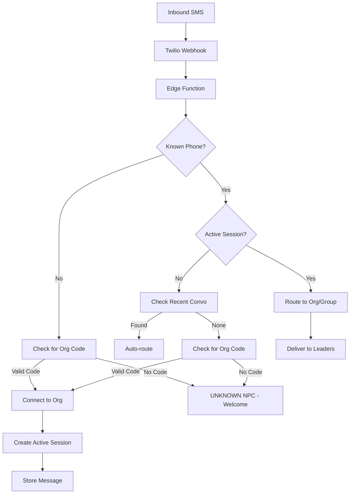

# SMS Messaging

Two-way texting with Twilio integration.

## Overview

SMS Messaging enables two-way text communication between ministry leaders and students. It includes conversation threads, session-based routing, and an NPC router that directs messages to the appropriate group leaders.

## Status

🟡 **In Progress** — Core messaging works, NPC router needs completion

## SMS Flow



## Routing Levels

### Org-Level Routing (Default)

When someone texts an **org code** (e.g., "ECHO"), they connect directly to the org inbox:

```
User: "ECHO"
System: "Connected to Echo! A leader will text you back soon. 🙌"
```

- Message stored with `group_id = NULL`
- Any org leader can see and respond
- Simplest path for new contacts

### Group-Level Routing (Future)

Group codes can be added later for direct group routing:

```
User: "MSBOYS"
System: "Connected to MS Boys! A leader will text you back soon. 🙌"
```

- Message stored with specific `group_id`
- Only that group's leaders see the message

## Key Components

| Component | Path | Purpose |
|-----------|------|---------|
| `ConversationThread` | `src/components/sms/ConversationThread.tsx` | Message display |
| `MessageComposer` | `src/components/sms/MessageComposer.tsx` | Send messages |
| `SmsWaitingRoom` | `src/components/sms/SmsWaitingRoom.tsx` | Unknown numbers |

## Database Tables

### `sms_messages`

| Column | Type | Purpose |
|--------|------|---------|
| `id` | uuid | Primary key |
| `organization_id` | uuid | Owning organization |
| `student_id` | uuid | Related student (nullable) |
| `direction` | text | 'inbound' or 'outbound' |
| `body` | text | Message content |
| `from_number` | text | Sender phone |
| `to_number` | text | Recipient phone |
| `twilio_sid` | text | Twilio message ID |
| `status` | text | sent/delivered/failed/received |
| `sent_by` | uuid | Leader who sent (outbound) |
| `group_id` | uuid | Related group (for routing) |

### `sms_sessions`

| Column | Type | Purpose |
|--------|------|---------|
| `id` | uuid | Primary key |
| `phone_number` | text | Phone number |
| `organization_id` | uuid | Organization context |
| `group_id` | uuid | Group context (nullable) |
| `status` | text | pending_group / active / pending_switch / ended |
| `started_at` | timestamptz | Session start |
| `is_first_message` | boolean | True until first message routed (for welcome vs footer) |
| `pending_switch_org_id` | uuid | Target org when awaiting YES confirmation |

## NPC Router System

The NPC router provides a clean, MUD-style command interface for SMS routing.

### Commands

| Command | Description | Example |
|---------|-------------|---------|
| `HELP` | Show available commands and current connection | `HELP` |
| `EXIT` | Disconnect and start fresh | `EXIT` |
| `SWITCH [code]` | Connect to a different ministry | `SWITCH youth` |

### User Experience Flows

**New Unknown Number:**
```
User: "Hey"
NPC:  "Welcome! Text your ministry code to connect.
       Type HELP for commands."
```

**First Connection to Org:**
```
User: "echo"
NPC:  "Welcome to Echo Students! Type HELP anytime for options.

       Your messages now go directly to our team.
       The #ECHO tag below shows you're connected.

       #ECHO"
```

**Subsequent Messages (Conversation Mode):**
```
User: "Can I bring a friend Wednesday?"
NPC:  "#ECHO"
```
- Message silently routes to inbox
- User sees minimal footer confirming connection
- No "a leader will reach out" noise

**HELP Command:**
```
User: "HELP"
NPC:  "Commands:
       - HELP - Show this menu
       - EXIT - Disconnect and start fresh
       - SWITCH [code] - Connect to a different ministry

       Currently connected to: Echo Students #ECHO"
```

**EXIT Command:**
```
User: "EXIT"
NPC:  "Disconnected. Text a ministry code to reconnect.
       Type HELP for commands."
```

**SWITCH Command:**
```
User: "SWITCH youth"
NPC:  "Switched! Welcome to Youth Group.

       #YOUTH"
```

**Auto-Detect Code (With Confirmation):**
When a user texts what looks like an org code while already connected:
```
User: "youth"  (while connected to ECHO)
NPC:  "Switch to Youth Group? Reply YES to confirm, or continue your message."

User: "YES"
NPC:  "Switched! Welcome to Youth Group. #YOUTH"
```

Or if they meant to send a message:
```
User: "No I was asking about youth group events"
NPC:  "#ECHO"  (routes as normal message)
```

### Routing Logic

1. **Check for pending switch** — If awaiting YES confirmation, handle the response
2. **Check for commands** — EXIT, HELP, SWITCH
3. **Check if org code** — If already connected to different org, prompt for switch confirmation
4. **Check recent conversation** — If leader texted student in last 24h, auto-route reply
5. **Check active session** — If session exists, route to session group
6. **Check known student** — Auto-route based on student's groups
7. **Unknown contact** — Send welcome message

### Session Status Values

| Status | Description |
|--------|-------------|
| `pending_group` | User needs to select a group |
| `active` | Connected and routing messages |
| `pending_switch` | Awaiting YES confirmation for org switch |
| `ended` | Session closed via EXIT or expiration |

### Session Expiration

Sessions expire after 24 hours of inactivity.

## Sender Identity

Every outgoing SMS includes sender identification:

### SMS Signatures

When a team member sends an SMS, their display name is automatically appended:
```
Hey! We missed you Wednesday.

- Pastor Mike
```

Team members set their display name when:
1. Accepting a team invitation (prompted during signup)
2. Editing their profile in Settings → Account

### Dashboard Visibility

Conversations show which team member sent each message:
```
┌─────────────────────────────────────┐
│ 📤 Hey! We missed you Wednesday.    │
│    Pastor Mike · 2:30 PM · sent     │
│                                     │
│    👋 Yeah I was sick. Coming Sun!  │ 📥
│    3:45 PM                          │
│                                     │
│ 📤 Great! Feel better!              │
│    Sarah Johnson · 3:47 PM · sent   │
└─────────────────────────────────────┘
```

### Fallback Behavior

- If no display name is set, messages are sent without a signature
- In the dashboard, "Staff" is shown for senders without display names
- "You" is shown for messages sent by the current user

## Conversation Threads

Displayed in student profile → Messages tab:

```
┌─────────────────────────────────────┐
│ 📤 Hey! We missed you Wednesday.    │
│    Pastor Mike · 2:30 PM            │
│                                     │
│    👋 Yeah I was sick. Coming Sun!  │ 📥
│    3:45 PM                          │
│                                     │
│ 📤 Great! Feel better!              │
│    Pastor Mike · 3:47 PM            │
└─────────────────────────────────────┘
```

## Outbound Messaging

From student profile:
1. Go to Messages tab
2. Type message in composer
3. Click Send
4. Message delivered via Twilio

```typescript
// API call
POST /api/sms/send
{
  to: "+15551234567",
  body: "Message content",
  studentId: "uuid"
}
```

## RPC Functions

| Function | Purpose |
|----------|---------|
| `phone_last_10(phone)` | Normalize to 10 digits |
| `find_recent_conversation(phone)` | Auto-route target |
| `find_student_groups(phone)` | Student's groups |
| `get_active_sms_session(phone)` | Current session |
| `find_org_by_code(code)` | Lookup org by code |
| `list_org_groups_for_sms(org_id)` | Groups for menu |

## Twilio Configuration

### Webhook Setup

**Twilio Console:**
1. Phone Numbers → Select number
2. Messaging → Webhook URL
3. Set to: `https://your-domain.com/api/sms/receive` or Edge Function URL
4. Method: POST

### Environment Variables

```
TWILIO_ACCOUNT_SID=AC...
TWILIO_AUTH_TOKEN=...
TWILIO_PHONE_NUMBER=+1...
```

## Edge Function

**Path:** `supabase/functions/receive-sms/`

Handles:
- Phone number normalization
- Session management
- NPC persona selection
- Message routing
- Response generation

## Waiting Room

For unknown phone numbers:
- Messages stored with `student_id = null`
- Displayed in admin "Waiting Room" view
- Admin can match to existing student or create new

## Hooks

```typescript
// Conversation for student
const { data: messages } = useSmsConversation(studentId);

// Send message mutation
const { mutate: sendSms } = useSendSms();
```

## Configuration

Required:
- Twilio account with phone number
- Environment variables configured
- Webhook URL set in Twilio

## Analytics Events

SMS events are logged by the Edge Function with structured `SMS_EVENT` console logs:

### Outbound SMS Events (send-sms function)

| Event | When | Key Properties |
|-------|------|----------------|
| `SMS_SENT` | Team member sent SMS | `org_id`, `student_id`, `sender_user_id`, `sender_display_name`, `has_signature`, `phone_last4`, `body_length` |

### Inbound SMS Events (receive-sms function)

| Event | When | Key Properties |
|-------|------|----------------|
| `SMS_RECEIVED` | Every inbound SMS | `phone_last4`, `body_length` |
| `SMS_SESSION_STARTED` | New session created | `org_id`, `group_id`, `status` |
| `SMS_ORG_CONNECTED` | Student texts valid org code | `org_id`, `org_name`, `is_first_connection` |
| `SMS_MESSAGE_ROUTED` | Message stored with routing | `org_id`, `group_id`, `is_lobby` |
| `SMS_EXIT_COMMAND` | User typed EXIT | `org_id`, `phone_last4` |
| `SMS_SWITCH_COMMAND` | User typed SWITCH [code] | `org_id`, `org_name`, `phone_last4` |
| `SMS_SWITCH_PROMPTED` | Auto-detected org code, awaiting confirmation | `current_org_id`, `target_org_id`, `target_org_name` |
| `SMS_SWITCH_CONFIRMED` | User confirmed switch with YES | `from_org_id`, `to_org_id`, `phone_last4` |

These can be extracted from Supabase Edge Function logs for analytics.

## Known Issues / Future Plans

- [x] Complete NPC router edge function (org-level routing)
- [x] MUD-style command interface (HELP, EXIT, SWITCH)
- [x] Auto-detect org code with confirmation flow
- [x] First-message welcome vs subsequent footer
- [ ] Group-level routing (text group code directly)
- [ ] AI-powered responses for unanswered questions
- [ ] Group broadcast messaging
- [ ] Message templates
- [ ] Scheduled messages
- [ ] MMS support (images)
- [ ] Delivery status tracking
- [ ] Opt-out handling
