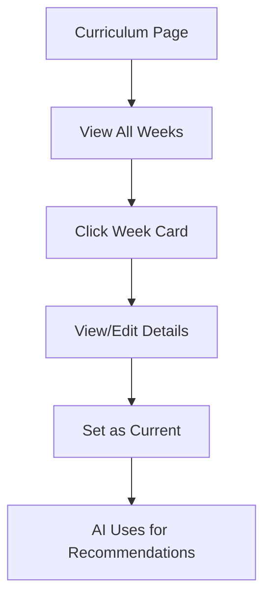

# Curriculum

Weekly teaching content for AI context.

## Overview

The Curriculum feature stores weekly teaching content (topics, scriptures, application challenges) that provides context for AI recommendations. When generating pastoral insights, Claude uses the current week's curriculum to make recommendations relevant to what students are learning.

## Status

🟢 **Complete**

## User Flow



## Key Components

| Component | Path | Purpose |
|-----------|------|---------|
| `CurriculumPage` | `src/app/(protected)/[org]/curriculum/page.tsx` | Curriculum list |
| `CurriculumWeekCard` | `src/components/curriculum/CurriculumWeekCard.tsx` | Week summary |
| `CurriculumEditor` | `src/components/curriculum/CurriculumEditor.tsx` | Create/edit week |
| `CurrentCurriculumBadge` | `src/components/curriculum/CurrentBadge.tsx` | "Current" indicator |

## Database Table

### `curriculum_weeks`

| Column | Type | Purpose |
|--------|------|---------|
| `id` | uuid | Primary key |
| `week_date` | date | Week start date |
| `series_name` | text | Teaching series |
| `topic_title` | text | Week's topic |
| `main_scripture` | text | Primary passage |
| `big_idea` | text | One-sentence takeaway |
| `key_biblical_principle` | text | Core truth |
| `application_challenge` | text | Practical application |
| `core_truths` | text[] | Array of truths |
| `faith_skills` | text[] | Skills: Hear, Pray, Talk, Live |
| `target_phases` | text[] | Grade levels ('6'-'12') |
| `phase_relevance` | jsonb | Grade-specific relevance |
| `discussion_questions` | jsonb | Grade-specific questions |
| `memory_verse` | text | Optional memory verse |
| `is_current` | boolean | Active week flag |

## Curriculum Week Structure

```typescript
interface CurriculumWeek {
  id: string;
  week_date: string;
  series_name: string;          // "Identity in Christ"
  topic_title: string;          // "Who God Says You Are"
  main_scripture: string;       // "Ephesians 1:3-14"
  big_idea: string;             // "Your identity is found in Christ, not your circumstances"
  key_biblical_principle: string;
  application_challenge: string; // "This week, write down 3 things God says about you"
  core_truths: string[];        // ["You are chosen", "You are loved", ...]
  faith_skills: string[];       // ["Hear", "Pray"]
  target_phases: string[];      // ["6", "7", "8", "9", "10", "11", "12"]
  phase_relevance: Record<string, string>;
  discussion_questions: Record<string, string[]>;
  is_current: boolean;
}
```

## Phase Relevance

Each grade has specific developmental context:

| Grade | Phase Name | Focus |
|-------|-----------|-------|
| 6 | Who Cares | Belonging, acceptance |
| 7 | Big Deal | Identity formation |
| 8 | Changing Everything | Transition, change |
| 9 | Finding My Place | New environment |
| 10 | Half & Half | Balance, choices |
| 11 | Almost There | Future prep |
| 12 | Moving On | Independence |

Example `phase_relevance`:
```json
{
  "6": "At this age, students are asking 'Do I matter?' Help them see God chose them.",
  "9": "High schoolers are redefining identity. Ground them in who God says they are.",
  "12": "Seniors face big transitions. Remind them their identity travels with them."
}
```

## AI Integration

When generating recommendations, the prompt includes:

```
CURRENT CURRICULUM:
- Topic: {topic_title}
- Scripture: {main_scripture}
- Big Idea: {big_idea}
- Application: {application_challenge}
- Phase Relevance for {grade}: {phase_relevance[grade]}
```

This enables recommendations like:
> "Since you're teaching about identity this week, ask Marcus how he's processing that given he hasn't been around. The message about being 'chosen' might resonate with his situation."

## Current Week Flag

Only one week can be `is_current = true`.

**Setting current week:**
```typescript
// RPC function handles exclusivity
await supabase.rpc('set_current_curriculum', {
  p_curriculum_id: weekId
});
```

**Fetching current:**
```typescript
const { data } = await supabase
  .from('curriculum_weeks')
  .select('*')
  .eq('is_current', true)
  .single();
```

## Hooks

```typescript
// Fetch current curriculum
const { data: curriculum } = useCurrentCurriculum();

// Fetch all curriculum weeks
const { data: weeks } = useCurriculumWeeks(orgId);

// Update curriculum
const { mutate: updateCurriculum } = useUpdateCurriculum();
```

## Configuration

No external configuration. Curriculum is entered through the UI.

**Recommended workflow:**
1. Plan teaching series in advance
2. Enter curriculum weeks before each series
3. Set current week each Sunday
4. AI recommendations update automatically

## Known Issues / Future Plans

- [ ] Bulk import curriculum from CSV
- [ ] Curriculum templates (reuse series)
- [ ] Integration with Planning Center
- [ ] Auto-advance current week
- [ ] Archive past series
- [ ] Discussion question export for small groups
