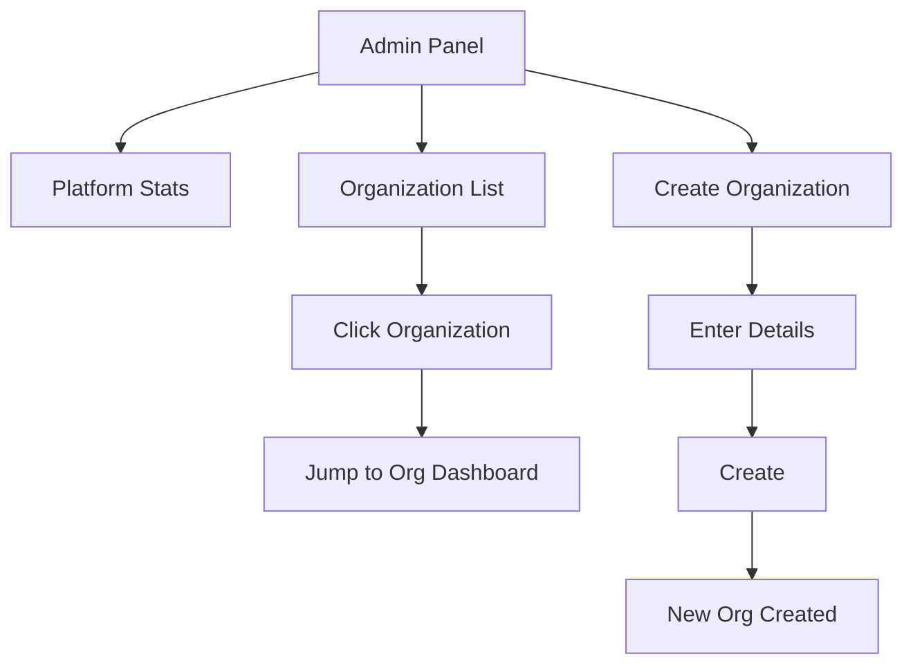

# Admin Panel

Super admin platform management.

## Overview

The Admin Panel is a platform-wide management interface accessible only to super administrators. It provides visibility into all organizations, platform statistics, and tools for creating new organizations.

## Status

🟢 **Complete**

## Access Control

Only users with `super_admin` role can access:
- Checked via `auth_is_super_admin(user_id)` function
- Redirects non-admins to their organization dashboard

## User Flow



## Key Components

| Component | Path | Purpose |
|-----------|------|---------|
| `AdminPage` | `src/app/(protected)/admin/page.tsx` | Admin dashboard |
| `PlatformStats` | `src/components/admin/PlatformStats.tsx` | Platform metrics |
| `OrganizationList` | `src/components/admin/OrganizationList.tsx` | All orgs table |
| `CreateOrgModal` | `src/components/admin/CreateOrgModal.tsx` | New org form |

## Platform Statistics

| Metric | Description |
|--------|-------------|
| **Total Organizations** | All orgs on platform |
| **Total Students** | Students across all orgs |
| **Total Check-ins** | All-time check-ins |
| **Active This Week** | Students with recent activity |

## Organization List

Table showing all organizations:

| Column | Description |
|--------|-------------|
| Name | Organization display name |
| Slug | URL slug |
| Owner | Owner email |
| Students | Student count |
| Status | active/suspended |
| Created | Creation date |

**Actions:**
- Click row → Jump to org dashboard
- Edit org details
- Suspend/activate org

## Create Organization

Form fields:

| Field | Required | Description |
|-------|----------|-------------|
| Name | Yes | Organization name |
| Slug | Yes | URL-friendly identifier |
| Owner Email | Yes | Initial owner |
| Timezone | No | Default: America/Chicago |

**Process:**
1. Fill out form
2. Validate slug uniqueness
3. Create organization record
4. Send invitation to owner
5. Owner completes setup

## Database Queries

### List All Organizations

```typescript
// Uses RPC function (super admin only)
const { data } = await supabase.rpc('get_all_organizations');
```

### Create Organization

```typescript
const { data } = await supabase.rpc('create_organization', {
  p_name: 'New Church Youth',
  p_owner_email: 'pastor@newchurch.org',
  p_slug: 'new-church-youth',
  p_timezone: 'America/Chicago'
});
```

## RPC Functions

| Function | Purpose |
|----------|---------|
| `is_super_admin(user_id)` | Check admin status |
| `get_all_organizations()` | List all orgs with stats |
| `create_organization(...)` | Create new org |

## Security

### RLS Policies

Super admin functions use `SECURITY DEFINER` to bypass normal RLS:

```sql
CREATE FUNCTION auth_is_super_admin(p_user_id UUID)
RETURNS BOOLEAN
SECURITY DEFINER
AS $$
  SELECT EXISTS (
    SELECT 1 FROM organization_members
    WHERE user_id = p_user_id
    AND role = 'super_admin'
  );
$$ LANGUAGE sql;
```

### Route Protection

```typescript
// Middleware or page-level check
const { data: isAdmin } = await supabase
  .rpc('is_super_admin', { p_user_id: user.id });

if (!isAdmin) {
  redirect('/dashboard');
}
```

## Hooks

```typescript
// Check admin status
const { data: isAdmin } = useSuperAdminCheck();

// Fetch all organizations
const { data: orgs } = useAllOrganizations();

// Create organization
const { mutate: createOrg } = useCreateOrganization();
```

## Jump to Organization

Super admins can "impersonate" any organization:
1. Click organization in list
2. Redirected to `/{org-slug}/dashboard`
3. Full access to that org's data
4. Useful for support and debugging

## Configuration

No special configuration. Super admin role assigned manually in database.

**To create super admin:**
```sql
INSERT INTO organization_members (user_id, role, status)
VALUES ('user-uuid', 'super_admin', 'active');
```

## Known Issues / Future Plans

- [ ] Organization suspension with data retention
- [ ] Platform-wide announcements
- [ ] Usage analytics per org
- [ ] Billing integration
- [ ] Support ticket system
- [ ] Organization data export
- [ ] Audit log for admin actions
