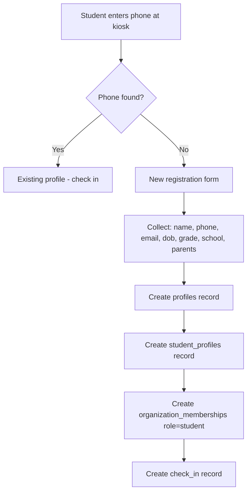
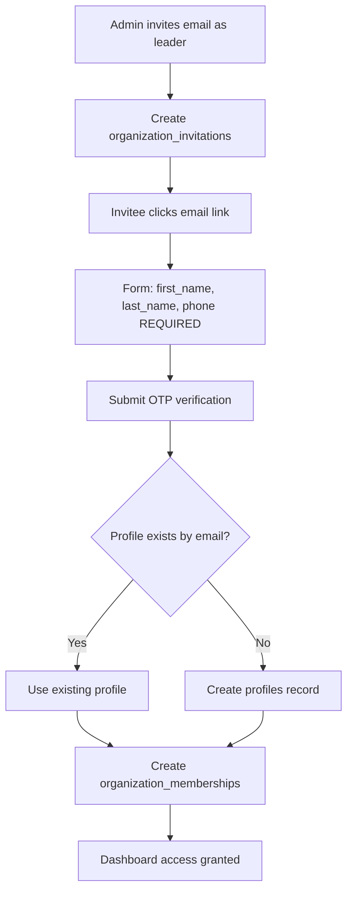
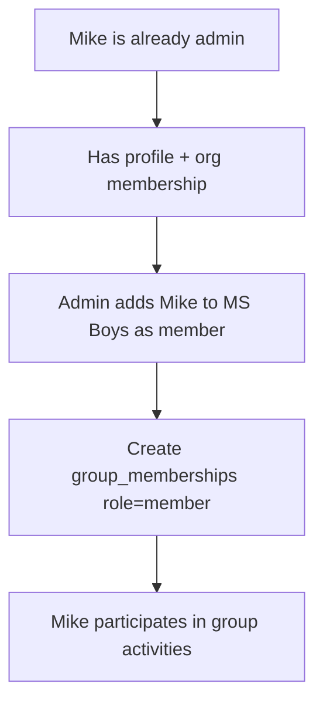
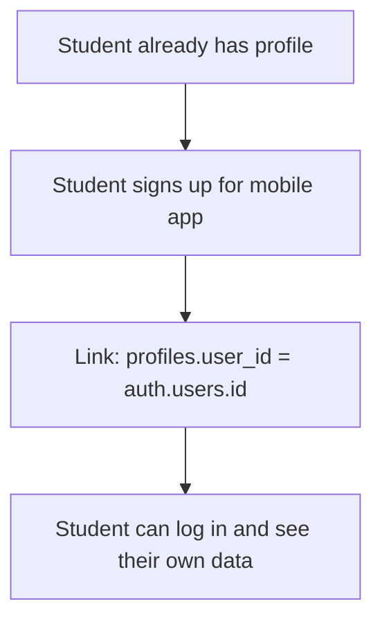

# User Profiles

Unified identity system for all users in the platform.

## Overview

Every person in the system has ONE profile, regardless of their role. A profile can be:
- A student (checks in at events)
- A team member (admin, leader, viewer)
- Both simultaneously

This unified approach means:
- No duplicate records for the same person
- Consistent contact info across roles
- Easier family relationships
- Single source of truth for identity

## Status

🟢 **Complete** — New identity system deployed

## Data Model

### `profiles`

Core identity table — one record per human.

| Column | Type | Description |
|--------|------|-------------|
| `id` | uuid | Primary key |
| `first_name` | text | Required |
| `last_name` | text | Required |
| `email` | text | Unique across platform |
| `phone_number` | text | Unique, E.164 format |
| `date_of_birth` | date | Optional |
| `user_id` | uuid | Links to auth.users (nullable) |
| `created_at` | timestamptz | Record creation |
| `updated_at` | timestamptz | Last modification |

**Key constraints:**
- Email is unique across the entire platform
- Phone number is unique and in E.164 format (+15551234567)
- `user_id` is set when the person has an authenticated account

### `organization_memberships`

Defines what role a profile has in each organization.

| Column | Type | Description |
|--------|------|-------------|
| `id` | uuid | Primary key |
| `profile_id` | uuid | FK to profiles |
| `organization_id` | uuid | FK to organizations |
| `role` | text | owner, admin, leader, viewer, student |
| `status` | text | active, pending, suspended |
| `created_at` | timestamptz | When joined |
| `updated_at` | timestamptz | Last modification |

**Unique constraint:** One membership per profile per organization.

### `group_memberships`

Defines participation in groups (both leaders and members).

| Column | Type | Description |
|--------|------|-------------|
| `id` | uuid | Primary key |
| `profile_id` | uuid | FK to profiles |
| `group_id` | uuid | FK to groups |
| `role` | text | leader, member |
| `is_primary` | boolean | Primary leader designation |
| `joined_at` | timestamptz | When joined |

**Unique constraint:** One membership per profile per group.

### `student_profiles`

Optional extension for student-specific data.

| Column | Type | Description |
|--------|------|-------------|
| `profile_id` | uuid | PK, FK to profiles |
| `grade` | text | Grade level (6-12, Adult) |
| `high_school` | text | School name |
| `instagram_handle` | text | Social handle |
| `address` | text | Street address |
| `city` | text | City |
| `state` | text | State |
| `zip` | text | ZIP code |
| `profile_pin` | text | 4-digit PIN for kiosk access |
| `father_first_name` | text | Father's first name |
| `father_last_name` | text | Father's last name |
| `father_phone` | text | Father's phone |
| `father_email` | text | Father's email |
| `mother_first_name` | text | Mother's first name |
| `mother_last_name` | text | Mother's last name |
| `mother_phone` | text | Mother's phone |
| `mother_email` | text | Mother's email |
| `parent_name` | text | Legacy: guardian name |
| `parent_phone` | text | Legacy: guardian phone |

## Role Hierarchy

| Role | Dashboard Access | Send SMS | View Students | Is Participant |
|------|-----------------|----------|---------------|----------------|
| owner | Yes | Yes | All in org | Optional |
| admin | Yes | Yes | All in org | Optional |
| leader | Yes | Yes | In their groups | Optional |
| viewer | Yes | No | In their groups | Optional |
| student | No | No | Self only | Yes |

A person can have **different roles in different orgs** and **be both leader AND member** in the same group.

## User Flows

### New Student Check-in (Registration)



**Records created:**
1. `profiles` — Core identity (name, phone, email, dob)
2. `student_profiles` — Student-specific data (grade, school, parents)
3. `organization_memberships` — Role in org (role='student', status='active')
4. `check_ins` — The actual check-in event

### Team Member Invited



**Required fields on invite acceptance:**
- First name
- Last name
- Phone number (for team communication)

### Admin Also Joins a Group



Same profile, no duplication. Mike can be both admin and group member.

### Student Creates Auth Account (Future)



## Required Fields

When joining the platform (via invite or check-in):

| Field | Students | Team Members |
|-------|----------|--------------|
| First name | Required | Required |
| Last name | Required | Required |
| Phone | Required | Required |
| Email | Optional | Required |

## RLS Security

Profiles are scoped by organization membership.

### Helper Functions

```sql
-- Get org IDs where user has access via profile system
auth_profile_org_ids(user_id UUID) RETURNS UUID[]
```

### Policy Rules

| Action | Who Can Do It |
|--------|---------------|
| View profiles | Members of same org |
| View own profile | Always |
| Update own profile | Always |
| Create profiles | System (via RPC) |

### Security Principles

1. **Organization scoped**: You can only view profiles in orgs you belong to
2. **Self-access**: You can always view and edit your own profile
3. **No cross-org visibility**: Admin of Org A cannot see profiles from Org B
4. **Role-based filtering**: Leaders only see profiles in their groups

## Component Structure

```
src/
├── app/(protected)/[org]/
│   ├── students/page.tsx          # Uses profiles + student_profiles
│   └── settings/team/page.tsx     # Uses profiles + organization_memberships
├── components/
│   ├── students/
│   │   └── StudentCard.tsx        # Displays profile data
│   └── team/
│       └── TeamMemberCard.tsx     # Displays profile data
├── hooks/queries/
│   ├── use-profiles.ts            # Profile queries
│   ├── use-organization-memberships.ts
│   └── use-group-memberships.ts
└── types/
    └── profiles.ts                # TypeScript interfaces
```

## Database Functions

### Check-in Functions

| Function | Purpose |
|----------|---------|
| `search_student_for_checkin(term)` | Searches profiles + student_profiles |
| `register_student_and_checkin(...)` | Creates profile → student_profile → org_membership → check_in |
| `checkin_student(profile_id)` | Creates check_in for existing profile |

### Organization Functions

| Function | Purpose |
|----------|---------|
| `get_organization_members(org_id)` | Returns organization_memberships + profiles |
| `accept_pending_invitations(user_id, email, display_name)` | Creates profile + organization_membership |
| `get_user_organizations(user_id)` | Returns orgs via profile → organization_memberships |

### Group Functions

| Function | Purpose |
|----------|---------|
| `get_group_members(group_id)` | Returns group_memberships + profiles |
| `add_group_member(profile_id, group_id, role)` | Creates group_membership |

## Analytics Events

| Event | When | Properties |
|-------|------|------------|
| `Profile Created` | New profile registered | `org_id`, `profile_id`, `source`, `has_user_id` |
| `Profile Updated` | Profile info changed | `org_id`, `profile_id`, `fields_changed[]` |
| `Profile Linked` | Profile linked to auth account | `profile_id`, `user_id` |
| `Membership Created` | Profile joined org | `org_id`, `profile_id`, `role`, `source` |
| `Membership Updated` | Role or status changed | `org_id`, `profile_id`, `old_role`, `new_role` |
| `Group Membership Added` | Profile joined group | `org_id`, `group_id`, `profile_id`, `role` |

## Migration Notes

### From Old Tables

The new system replaces:
- `students` → `profiles` + `student_profiles`
- `organization_members` → `organization_memberships`
- `group_members` → `group_memberships` (role='member')
- `group_leaders` → `group_memberships` (role='leader')

### Dual-Write Period

During migration, the system writes to both old and new tables to ensure backwards compatibility. After validation, old tables will be dropped.

### Foreign Key Updates

Related tables now reference `profile_id` instead of `student_id`:
- `check_ins.profile_id`
- `student_game_stats.profile_id`
- `student_achievements.profile_id`
- `sms_messages.profile_id`
- `ai_recommendations.profile_id`
- `interactions.profile_id`
- `student_notes.profile_id`

## Future Enhancements

- [ ] Student self-service portal
- [ ] Profile merge/deduplication tool
- [ ] Family linking (parents as profiles)
- [ ] Multi-campus profile sharing
