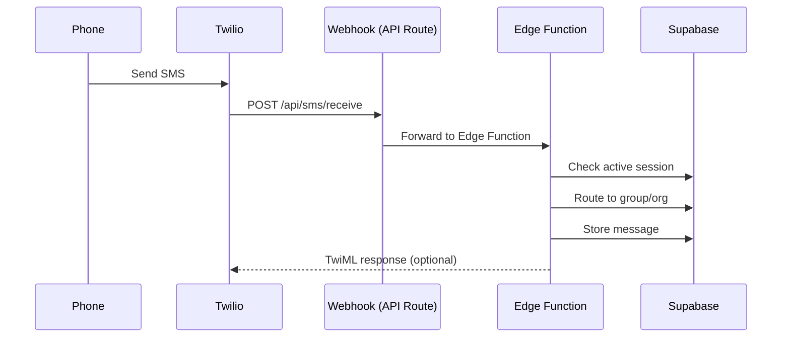

# Integrations

External service configuration for Sheepdoggo.

---

## Anthropic Claude (AI Recommendations)

AI-powered pastoral recommendations using Claude 3.5 Sonnet.

### Configuration

**Environment Variable:**
```
ANTHROPIC_API_KEY=sk-ant-...
```

**Usage Location:** Server-side only (API route)
- `src/app/api/recommendations/generate/route.ts`

### How It Works

1. **Prompt Construction** (`src/utils/aiRecommendations.ts`)
   - Student engagement data (belonging status, attendance pattern)
   - Current curriculum context (topic, scripture, application)
   - Phase-specific guidance (grade-appropriate language)

2. **API Call**
   ```typescript
   await fetch('https://api.anthropic.com/v1/messages', {
     method: 'POST',
     headers: {
       'Content-Type': 'application/json',
       'x-api-key': process.env.ANTHROPIC_API_KEY,
       'anthropic-version': '2023-06-01',
     },
     body: JSON.stringify({
       model: 'claude-3-5-sonnet-20241022',
       max_tokens: 1024,
       temperature: 0.7,
       messages: [{ role: 'user', content: prompt }],
     }),
   });
   ```

3. **Response Parsing**
   - Extracts: `key_insight`, `action_bullets` (3), `context_paragraph`
   - Stores in `ai_recommendations` table

### Prompt Structure

```
You are a youth pastor assistant helping with pastoral care.

STUDENT CONTEXT:
- Name: {first_name}
- Grade: {grade} (Phase: {phase_description})
- Belonging Status: {status}
- Last Seen: {days} days ago
- Attendance Pattern: {8-week pattern}

CURRENT CURRICULUM:
- Topic: {topic_title}
- Scripture: {main_scripture}
- Big Idea: {big_idea}
- Application: {application_challenge}

Generate a pastoral recommendation with:
1. Key Insight (one sentence, max 120 chars)
2. Three Action Bullets (specific, actionable)
3. Context Paragraph (2-4 sentences explaining why)
```

### Cost Considerations

- Model: Claude 3.5 Sonnet
- ~1,500 input tokens per request
- ~300 output tokens per request
- Batch generation preferred for cost efficiency

---

## Twilio (SMS Messaging)

Two-way SMS messaging for pastoral outreach.

### Configuration

**Environment Variables:**
```
TWILIO_ACCOUNT_SID=AC...
TWILIO_AUTH_TOKEN=...
TWILIO_PHONE_NUMBER=+1...
```

### Inbound SMS Flow



### Webhook Configuration

**Twilio Console → Phone Numbers → Configure:**
- Webhook URL: `https://your-domain.com/api/sms/receive`
- HTTP Method: POST

**Alternative (Edge Function direct):**
- URL: `https://{project-id}.supabase.co/functions/v1/receive-sms`

### Outbound SMS

```typescript
// src/app/api/sms/send/route.ts
const client = require('twilio')(accountSid, authToken);

await client.messages.create({
  body: messageBody,
  from: process.env.TWILIO_PHONE_NUMBER,
  to: recipientPhone,
});
```

### SMS Session Management

Sessions track conversation state for routing:

| Status | Meaning |
|--------|---------|
| `pending_group` | Waiting for group selection |
| `active` | Conversation routed to group |

Sessions expire after 24 hours of inactivity.

### NPC Router Personas

| Persona | Trigger | Behavior |
|---------|---------|----------|
| `ROUTER` | Known phone with session | Routes to appropriate group leaders |
| `UNKNOWN` | Unknown phone | Prompts for organization code |

---

## Resend (Email)

Transactional email for team invitations.

### Configuration

**Environment Variable:**
```
RESEND_API_KEY=re_...
```

### Usage

**Team Invitations:**
```typescript
import { Resend } from 'resend';

const resend = new Resend(process.env.RESEND_API_KEY);

await resend.emails.send({
  from: 'Sheepdoggo <noreply@sheepdoggo.com>',
  to: inviteeEmail,
  subject: 'You\'ve been invited to join...',
  html: invitationEmailTemplate,
});
```

### Email Templates

| Template | Purpose |
|----------|---------|
| Team Invitation | Invite new team member to organization |
| Password Reset | Supabase Auth handles this |

---

## Supabase

Backend-as-a-Service providing database, auth, and edge functions.

### Project IDs

| Environment | Project ID | Purpose |
|-------------|------------|---------|
| Staging | `vilpdnwkfsmvqsiktqdf` | Local dev + testing |
| Production | `hhjvsvezinrbxeropeyl` | Vercel deployment |

### Environment Variables

```
NEXT_PUBLIC_SUPABASE_URL=https://{project-id}.supabase.co
NEXT_PUBLIC_SUPABASE_ANON_KEY=eyJ...
```

### Client Setup

**Browser (Client Components):**
```typescript
// src/lib/supabase/client.ts
import { createBrowserClient } from '@supabase/ssr';

export function createClient() {
  return createBrowserClient(
    process.env.NEXT_PUBLIC_SUPABASE_URL!,
    process.env.NEXT_PUBLIC_SUPABASE_ANON_KEY!
  );
}
```

**Server (API Routes, Server Components):**
```typescript
// src/lib/supabase/server.ts
import { createServerClient } from '@supabase/ssr';
import { cookies } from 'next/headers';

export async function createClient() {
  const cookieStore = await cookies();
  return createServerClient(
    process.env.NEXT_PUBLIC_SUPABASE_URL!,
    process.env.NEXT_PUBLIC_SUPABASE_ANON_KEY!,
    {
      cookies: {
        getAll: () => cookieStore.getAll(),
        setAll: (cookies) => cookies.forEach(c => cookieStore.set(c)),
      },
    }
  );
}
```

### Edge Functions

Deploy via Supabase CLI:
```bash
supabase functions deploy receive-sms
```

Edge function secrets:
```bash
supabase secrets set TWILIO_AUTH_TOKEN=...
```

---

## Sentry (Error Tracking)

*Planned integration for production error monitoring.*

### Configuration

```
NEXT_PUBLIC_SENTRY_DSN=https://...@sentry.io/...
SENTRY_AUTH_TOKEN=...
```

### Setup

```typescript
// sentry.client.config.ts
import * as Sentry from '@sentry/nextjs';

Sentry.init({
  dsn: process.env.NEXT_PUBLIC_SENTRY_DSN,
  environment: process.env.NODE_ENV,
  tracesSampleRate: 0.1,
});
```

---

## Vercel (Hosting)

Production deployment platform.

### Configuration

**Auto-deploy:** Connected to `main` branch on GitHub

**Environment Variables:** Set in Vercel dashboard
- All `NEXT_PUBLIC_*` variables
- All server-side secrets

### Domains

| Domain | Environment |
|--------|-------------|
| `sheepdoggo.vercel.app` | Preview |
| `sheepdoggo.com` | Production (planned) |

---

## Environment Variables Summary

### Required

| Variable | Location | Description |
|----------|----------|-------------|
| `NEXT_PUBLIC_SUPABASE_URL` | Client + Server | Supabase project URL |
| `NEXT_PUBLIC_SUPABASE_ANON_KEY` | Client + Server | Supabase anon key |
| `ANTHROPIC_API_KEY` | Server only | Claude AI API key |

### Optional (Feature-Dependent)

| Variable | Location | Description |
|----------|----------|-------------|
| `TWILIO_ACCOUNT_SID` | Server only | Twilio account ID |
| `TWILIO_AUTH_TOKEN` | Server only | Twilio auth token |
| `TWILIO_PHONE_NUMBER` | Server only | Twilio phone number |
| `RESEND_API_KEY` | Server only | Resend email API key |

### Development Only

| Variable | Description |
|----------|-------------|
| `NEXT_PUBLIC_DEV_MODE` | Enable dev features |

---

## Testing Integrations Locally

### SMS Testing

1. Use Twilio test credentials (won't send real SMS)
2. Or use ngrok to expose local webhook:
   ```bash
   ngrok http 3000
   # Update Twilio webhook to ngrok URL
   ```

### AI Testing

- Claude API works in dev mode
- Consider caching responses during development
- Mock responses for unit tests

### Email Testing

- Resend has test mode
- Or use Mailtrap for local testing
