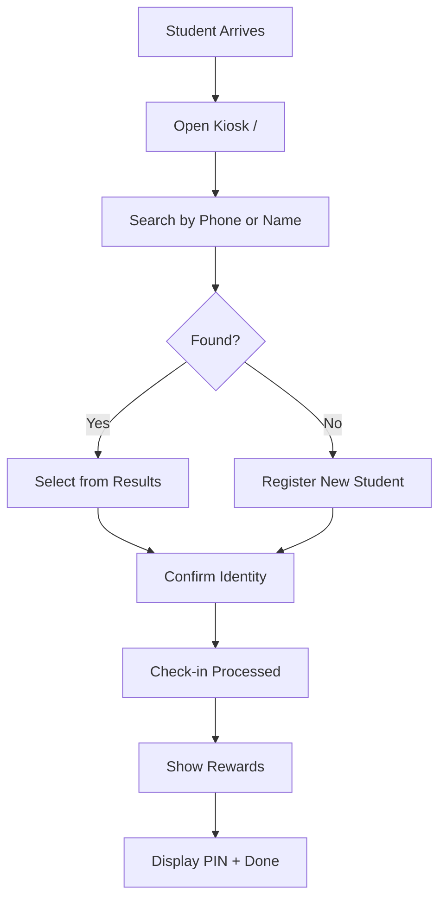

# Check-in System

JRPG-themed public kiosk for student check-ins.

## Overview

The check-in system is a public-facing kiosk that allows students to check themselves in when they arrive. It features a JRPG (Japanese Role-Playing Game) visual theme with pixel art styling, making the check-in process fun and engaging for students.

## Status

🟢 **Complete**

## User Flow

## Key Components

| Component | Path | Purpose |
|-----------|------|---------|
| `CheckInPage` | `src/app/(public)/page.tsx` | Main kiosk page |
| `StudentSearch` | `src/components/checkin/StudentSearch.tsx` | Fuzzy search input |
| `StudentCard` | `src/components/checkin/StudentCard.tsx` | Search result display |
| `CheckInConfirmation` | `src/components/checkin/CheckInConfirmation.tsx` | Identity confirmation |
| `RewardsDisplay` | `src/components/checkin/RewardsDisplay.tsx` | Points and achievements |
| `RegistrationForm` | `src/components/checkin/RegistrationForm.tsx` | New student form |

## Database Tables

- `profiles` — Core identity (one per person)
- `student_profiles` — Student-specific data (grade, school, parents)
- `organization_memberships` — Role in org (role='student' for check-in users)
- `check_ins` — Check-in events (one per day per profile)
- `student_game_stats` — Points and rank (linked to profile_id)
- `student_achievements` — Earned achievements (linked to profile_id)
- `game_transactions` — Point transaction log (linked to profile_id)

## RPC Functions

| Function | Purpose |
|----------|---------|
| `search_student_for_checkin(term)` | Fuzzy search profiles + student_profiles by phone/name/email |
| `checkin_student(profile_id)` | Create idempotent check-in for existing profile |
| `register_student_and_checkin(...)` | Create profile → student_profile → org_membership → check_in |
| `process_checkin_rewards(profile_id, checkin_id)` | Calculate rewards |

## Profile Creation

When a new student registers at the kiosk, the system creates multiple records to establish their unified identity:

### Records Created

1. **`profiles`** — Core identity record
   - `first_name`, `last_name` (required)
   - `phone_number` (required, unique, E.164 format)
   - `email` (optional)
   - `date_of_birth` (optional)

2. **`student_profiles`** — Student-specific extension
   - `profile_id` (links to profiles)
   - `grade` (required)
   - `high_school` (optional)
   - Parent contact info (mother/father name, phone, email)
   - `profile_pin` (generated on first check-in)

3. **`organization_memberships`** — Role in the organization
   - `profile_id` (links to profiles)
   - `organization_id` (current org)
   - `role` = 'student'
   - `status` = 'active'

4. **`check_ins`** — The actual check-in event
   - `profile_id` (links to profiles)
   - `organization_id`
   - `checked_in_at` (timestamp)

### Why This Architecture?

The unified profiles system ensures:
- **No duplicates**: Same person across roles uses ONE profile
- **Consistent data**: Phone and email are unique platform-wide
- **Easy relationships**: Families, groups, and teams all reference profiles
- **Role flexibility**: A student can later become a leader without duplicate records

## Features

### Fuzzy Search
- Searches `profiles` + `student_profiles` tables
- Searches phone numbers (with any formatting)
- Searches first and last names
- Searches email addresses
- Uses PostgreSQL trigram similarity
- Returns top 10 matches ranked by relevance

### Idempotent Check-ins
- Database constraint prevents duplicate daily check-ins
- If already checked in today, returns existing check-in
- Frontend shows friendly "already checked in" message

### Profile PINs
- 4-digit PIN generated on first check-in
- Used for profile access (future feature)
- Displayed on completion screen

### New Student Registration
- Minimal required fields: first name, phone, grade
- Optional: last name, email, high school
- Immediately checks in after registration

## JRPG Theme Elements

| Element | Implementation |
|---------|---------------|
| Pixel font | `font-pixel` CSS class |
| Speech bubbles | Card components with pointed borders |
| Level-up animation | Confetti on achievement unlock |
| Character sprites | Future enhancement |
| Sound effects | Future enhancement |

## Configuration

No special configuration required. Works on any device with a browser.

**Recommended setup:**
- Dedicated tablet or kiosk device
- Full-screen browser mode
- Auto-refresh on wake

## Known Issues / Future Plans

- [ ] Add offline mode with sync
- [ ] Add sound effects for rewards
- [ ] Add character sprite selection
- [ ] Add group-specific check-in kiosks
- [ ] Add facial recognition (far future)
