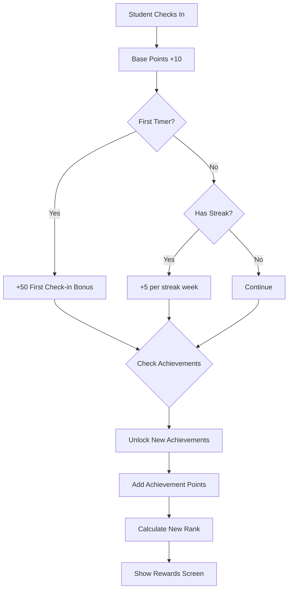

# Gamification

Points, ranks, achievements, and leaderboards.

## Overview

The gamification system turns attendance into an engaging game. Students earn points for checking in, unlock achievements for milestones, climb rank tiers, and compete on leaderboards. This increases engagement and gives students tangible progress markers.

## Status

🟢 **Complete**

## Reward Flow

## Key Components

| Component | Path | Purpose |
|-----------|------|---------|
| `RewardsDisplay` | `src/components/checkin/RewardsDisplay.tsx` | Check-in reward screen |
| `Leaderboard` | `src/components/analytics/Leaderboard.tsx` | Top students by points |
| `AchievementCard` | `src/components/gamification/AchievementCard.tsx` | Achievement display |
| `RankBadge` | `src/components/gamification/RankBadge.tsx` | Rank tier display |

## Database Tables

### `student_game_stats`
Cumulative stats per student.

| Column | Purpose |
|--------|---------|
| `total_points` | Lifetime points |
| `current_rank` | Current rank tier |

### `student_achievements`
Earned achievements.

| Column | Purpose |
|--------|---------|
| `achievement_id` | Achievement identifier |
| `achievement_title` | Display name |
| `points_awarded` | Points given |
| `rarity` | common/rare/epic/legendary |
| `unlocked_at` | When earned |

### `game_transactions`
Point transaction audit log.

| Column | Purpose |
|--------|---------|
| `points_earned` | Points awarded |
| `transaction_type` | Type of transaction |
| `check_in_id` | Related check-in |

## Point System

### Base Points

| Action | Points |
|--------|--------|
| Regular check-in | +10 |
| First check-in ever | +50 |
| Student leader check-in | +15 |

### Streak Bonuses

| Streak Length | Bonus |
|--------------|-------|
| 2 weeks | +10 |
| 3 weeks | +15 |
| 4 weeks | +20 |
| 5+ weeks | +25 |

### Special Bonuses

| Bonus | Points | Trigger |
|-------|--------|---------|
| Early Bird | +5 | Check-in before start time |
| Weekend Warrior | +5 | Sunday attendance |
| Midweek Hero | +5 | Wednesday attendance |
| Dedication | +10 | Multiple days same week |

## Rank Tiers

| Rank | Points Required | Emoji |
|------|-----------------|-------|
| Newcomer | 0-99 | 🌱 |
| Regular | 100-299 | 🛡️ |
| Committed | 300-599 | ⚔️ |
| Devoted | 600-999 | 💎 |
| Champion | 1000-1999 | 👑 |
| Legend | 2000+ | 🌟 |

## Achievements

### Attendance Category

| Achievement | Rarity | Points | Requirement |
|------------|--------|--------|-------------|
| First Steps | Common | 10 | First check-in |
| Getting Started | Common | 20 | 5 check-ins |
| Regular | Common | 30 | 10 check-ins |
| Dedicated | Rare | 50 | 25 check-ins |
| Committed | Rare | 75 | 50 check-ins |
| Faithful | Epic | 100 | 100 check-ins |

### Streak Category

| Achievement | Rarity | Points | Requirement |
|------------|--------|--------|-------------|
| 2 Week Streak | Common | 20 | 2 consecutive weeks |
| Month Warrior | Rare | 50 | 4 consecutive weeks |
| Unstoppable | Epic | 100 | 8 consecutive weeks |
| Legendary Streak | Legendary | 200 | 12 consecutive weeks |

### Special Category

| Achievement | Rarity | Points | Requirement |
|------------|--------|--------|-------------|
| Early Bird | Common | 15 | 3 early check-ins |
| Night Owl | Common | 15 | 3 evening check-ins |
| Perfect Week | Rare | 40 | Wed + Sun same week |
| Anniversary | Epic | 100 | Check-in 1 year later |

## Leaderboard

**Display:** Top 10 students by total points

**Columns:**
- Rank (#1, #2, etc.)
- Student name
- Current rank badge
- Total points

**Refresh:** Real-time with TanStack Query

## RPC Functions

| Function | Purpose |
|----------|---------|
| `process_checkin_rewards(student_id, checkin_id)` | Calculate all rewards |
| `award_points(...)` | Add points with logging |
| `unlock_achievement(...)` | Grant achievement |
| `get_student_game_profile(student_id)` | Get full game data |

## Configuration

No special configuration. Achievements and point values are defined in the database.

## Known Issues / Future Plans

- [ ] Achievement gallery page
- [ ] Seasonal achievements
- [ ] Team/group competitions
- [ ] Redeemable rewards
- [ ] Achievement sharing
