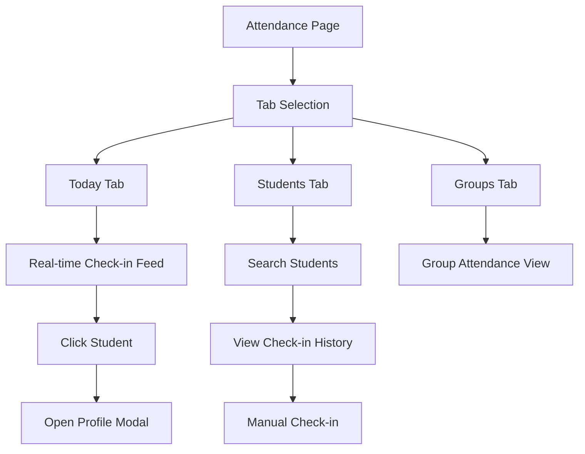

# Attendance

Today's feed, history, and manual entry.

## Overview

The Attendance feature provides visibility into student check-ins with three views: Today's real-time feed, individual student history, and manual check-in for retroactive entries. It helps leaders track who's present and identify patterns.

## Status

🟢 **Complete**

## User Flow



## Key Components

| Component | Path | Purpose |
|-----------|------|---------|
| `AttendancePage` | `src/app/(protected)/[org]/attendance/page.tsx` | Main attendance view |
| `TodaysCheckInsModal` | `src/components/dashboard/TodaysCheckInsModal.tsx` | Today's check-in list |
| `CheckInFeed` | `src/components/attendance/CheckInFeed.tsx` | Real-time feed |
| `StudentAttendance` | `src/components/attendance/StudentAttendance.tsx` | Individual history |
| `ManualCheckIn` | `src/components/attendance/ManualCheckIn.tsx` | Retroactive entry |
| `AttendanceCleanup` | `src/components/settings/AttendanceCleanup.tsx` | Delete bad data |

## Database Tables

### `check_ins`

| Column | Type | Purpose |
|--------|------|---------|
| `id` | uuid | Primary key |
| `student_id` | uuid | FK to students |
| `organization_id` | uuid | FK to organizations |
| `checked_in_at` | timestamptz | Check-in timestamp |
| `created_at` | timestamptz | Record creation |

**Constraints:**
- UNIQUE on `(student_id, DATE(checked_in_at))` — one per day

## Tab Views

### Today Tab
- **Purpose:** See who's checked in today
- **Features:**
  - Real-time updates (polling every 60 seconds)
  - Sorted by check-in time (most recent first)
  - Shows name, grade, time
  - Click to open profile modal

### Students Tab
- **Purpose:** Individual student attendance history
- **Features:**
  - Search by name or phone
  - View all check-ins for student
  - Manual check-in button
  - Shows attendance pattern

### Groups Tab
- **Purpose:** Group-level attendance
- **Features:**
  - Select a group
  - See which members attended today
  - View group attendance rate

## Manual Check-in

For retroactive entries (leader forgot to check in student):

1. Navigate to Students tab
2. Search for student
3. Click "Manual Check-in"
4. Select date
5. Confirm

**Note:** Manual check-ins follow the same idempotent rule (one per day).

## Dashboard Integration

The dashboard stat card "Check-ins Today" is clickable:
- Opens `TodaysCheckInsModal`
- Shows list of today's check-ins
- Click any student to view profile

## Hooks

```typescript
// Today's check-ins
const { data: checkIns } = useTodaysCheckIns(orgId);

// Student's check-in history
const { data: history } = useStudentCheckIns(studentId);

// Manual check-in mutation
const { mutate: checkIn } = useManualCheckIn();
```

## RPC Functions

| Function | Purpose |
|----------|---------|
| `checkin_student(student_id)` | Create check-in (idempotent) |
| `import_historical_checkin(...)` | Import from CSV |

## Attendance Cleanup Tool

Located in Settings → Organization Tools:

- View recent check-ins by date
- Delete check-ins for a specific date range
- Used to fix data entry errors
- Requires admin role

## Query Patterns

```typescript
// Today's check-ins
const today = new Date();
today.setHours(0, 0, 0, 0);

await supabase
  .from('check_ins')
  .select(`*, students(*)`)
  .eq('organization_id', orgId)
  .gte('checked_in_at', today.toISOString())
  .order('checked_in_at', { ascending: false });
```

## Configuration

No special configuration. Uses organization timezone for "today" calculation.

## Known Issues / Future Plans

- [ ] Export attendance to CSV
- [ ] Attendance rate goals
- [ ] Automated absence alerts
- [ ] Integration with school attendance
- [ ] Check-out tracking (arrival + departure)
