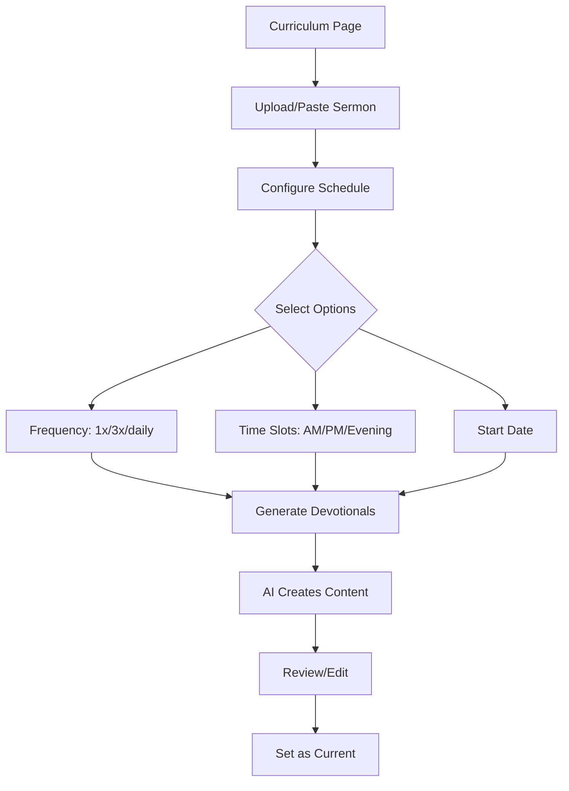

# Devotional Generator

AI-powered devotional content from sermon uploads.

## Overview

Upload your sermon → Pick schedule → AI generates devotionals for students and small group leaders.

The Devotional Generator takes your weekly sermon and creates age-appropriate devotional content that helps students engage with the teaching throughout the week.

## Status

🚧 **In Development**

## User Flow



## Key Components

| Component | Path | Purpose |
|-----------|------|---------|
| `CurriculumPage` | `src/app/(protected)/[org]/curriculum/page.tsx` | Main page with upload + config |
| `SermonUpload` | `src/components/curriculum/SermonUpload.tsx` | File drop + text paste |
| `ScheduleConfig` | `src/components/curriculum/ScheduleConfig.tsx` | Frequency + slots picker |
| `DevotionalSeriesView` | `src/components/curriculum/DevotionalSeriesView.tsx` | View generated series |
| `DevotionalCard` | `src/components/curriculum/DevotionalCard.tsx` | Single devotional display |

## Database Tables

### `devotional_series`

Stores the source sermon and schedule configuration.

| Column | Type | Purpose |
|--------|------|---------|
| `id` | uuid | Primary key |
| `organization_id` | uuid | Owner org |
| `sermon_title` | text | Optional title |
| `sermon_content` | text | Full sermon text |
| `frequency` | text | `1x_week`, `3x_week`, `daily` |
| `time_slots` | text[] | `['morning', 'afternoon', 'evening']` |
| `start_date` | date | When devotionals begin |
| `status` | text | `generating`, `ready`, `active`, `archived` |
| `created_by` | uuid | User who created |
| `created_at` | timestamptz | Creation time |

### `devotionals`

Individual AI-generated devotional content.

| Column | Type | Purpose |
|--------|------|---------|
| `id` | uuid | Primary key |
| `series_id` | uuid | Parent series |
| `day_number` | integer | 1, 2, 3... |
| `scheduled_date` | date | When to show |
| `time_slot` | text | `morning`, `afternoon`, `evening` |
| `title` | text | Devotional title |
| `scripture_reference` | text | e.g., "Ephesians 2:10" |
| `scripture_text` | text | Full passage text |
| `reflection` | text | Main devotional content |
| `prayer_prompt` | text | Prayer suggestion |
| `discussion_question` | text | For small groups |

## Frequency Options

| Frequency | Days Generated | Use Case |
|-----------|----------------|----------|
| `1x_week` | 1 day | Light engagement, busy students |
| `3x_week` | 3 days | Balanced approach |
| `daily` | 7 days | Deep engagement |

## Time Slots

Students can receive devotionals at different times:

| Slot | Default Time | Purpose |
|------|--------------|---------|
| Morning | 7:00 AM | Start day with scripture |
| Afternoon | 12:00 PM | Midday reset |
| Evening | 8:00 PM | End day in reflection |

## AI Generation

The Edge Function `generate-devotionals` uses Claude to create devotional content.

### Prompt Structure

```
You are creating devotional content for youth ministry students based on this sermon.

SERMON:
{sermon_content}

Generate {n} devotionals for these dates/slots:
- Feb 5 Morning
- Feb 5 Afternoon
...

Each devotional should:
- Be 2-3 minutes to read
- Connect to a key theme from the sermon
- Include a relevant scripture passage
- Have a reflection relatable to teens
- End with a prayer prompt
- Include a discussion question for small groups

Output as JSON array.
```

### Content Guidelines

Each devotional includes:

| Field | Length | Description |
|-------|--------|-------------|
| `title` | 5-10 words | Engaging, theme-related |
| `scripture_reference` | - | Book chapter:verse format |
| `scripture_text` | 1-3 verses | The actual passage |
| `reflection` | 150-250 words | Age-appropriate devotional |
| `prayer_prompt` | 1-2 sentences | Personal prayer starter |
| `discussion_question` | 1 question | For small group use |

## Hooks

```typescript
// Fetch all series for an org
const { data: series } = useDevotionalSeries(orgId);

// Fetch active series
const { data: active } = useActiveDevotionalSeries(orgId);

// Fetch devotionals in a series
const { data: devotionals } = useDevotionals(seriesId);

// Create new series
const { mutate: createSeries } = useCreateDevotionalSeries();

// Activate a series
const { mutate: activate } = useActivateDevotionalSeries();

// Update a devotional
const { mutate: update } = useUpdateDevotional();
```

## Status Flow

```
generating → ready → active
                  ↓
              archived
```

- **generating**: AI is creating content
- **ready**: Content generated, ready to review
- **active**: Currently in use (only one per org)
- **archived**: No longer in use

## Amplitude Events

| Event | When | Properties |
|-------|------|------------|
| `Sermon Uploaded` | User uploads/pastes | `source`, `content_length`, `file_type` |
| `Devotional Series Configured` | User sets schedule | `frequency`, `time_slots[]`, `total_devotionals` |
| `Devotional Generation Started` | AI begins | `series_id`, `devotional_count` |
| `Devotional Generation Completed` | AI finishes | `series_id`, `duration_ms`, `success` |
| `Devotional Series Activated` | Set as current | `series_id` |
| `Devotional Viewed` | Leader views one | `devotional_id`, `time_slot`, `day_number` |
| `Devotional Edited` | Leader edits AI content | `devotional_id`, `field_edited` |

## Future Enhancements

- [ ] PDF parsing for sermon upload
- [ ] Rich text editor for devotionals
- [ ] Student-facing devotional app (PWA)
- [ ] Push notifications for time slots
- [ ] Completion tracking per student
- [ ] Streak tracking for engagement
- [ ] Export devotionals for print

## Related Features

- **Curriculum Weeks**: Original teaching content for AI recommendations
- **AI Recommendations**: Pastoral insights based on curriculum
- **Groups**: Small group leaders use discussion questions

---

*Last Updated: February 3, 2026*
