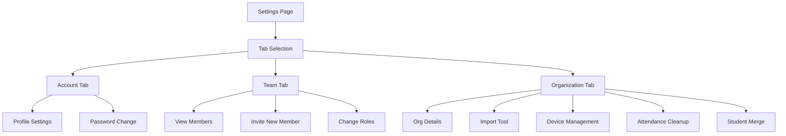

# Settings

Team management and organization tools.

## Overview

The Settings page provides configuration options organized into tabs: Account (personal settings), Team (member management), and Organization (org-wide tools). It's where administrators manage their team, import data, and configure organization settings.

## Status

🟢 **Complete**

## User Flow



## Key Components

| Component | Path | Purpose |
|-----------|------|---------|
| `SettingsPage` | `src/app/(protected)/[org]/settings/page.tsx` | Settings container |
| `AccountSettings` | `src/components/settings/AccountSettings.tsx` | Personal settings |
| `TeamSettings` | `src/components/settings/TeamSettings.tsx` | Team management |
| `OrgSettings` | `src/components/settings/OrgSettings.tsx` | Org tools |
| `InviteMemberModal` | `src/components/settings/InviteMemberModal.tsx` | Send invitations |
| `ImportTool` | `src/components/settings/ImportTool.tsx` | CSV import |
| `AttendanceCleanup` | `src/components/settings/AttendanceCleanup.tsx` | Delete check-ins |

## Account Tab

### Profile Settings
- Display name
- Email address
- Profile photo (future)

### Password
- Change password
- Uses Supabase Auth

## Team Tab

### Member List
- Shows all team members
- Displays role badges
- Status (active/pending)

### Roles

| Role | Permissions |
|------|-------------|
| **Owner** | Full access, can transfer ownership |
| **Admin** | Full access except ownership transfer |
| **Leader** | Can view/edit students, receive SMS |
| **Viewer** | Read-only access |

### Invitations
1. Click "Invite Member"
2. Enter email
3. Select role
4. Send invitation

**Email sent via Resend:**
- Contains signup link
- Links to specific organization
- Expires after 7 days

### Pending Invitations
- View sent invitations
- Resend or cancel
- See expiration status

## Organization Tab

### Organization Details
- Organization name
- Display name
- Short code (for SMS)
- Timezone

### Import Tool

Import students from CSV:

**Required columns:**
- `first_name`
- `phone_number`
- `grade`

**Optional columns:**
- `last_name`
- `email`
- `high_school`
- `parent_name`
- `parent_phone`

**Process:**
1. Upload CSV file
2. Map columns
3. Preview import
4. Confirm import
5. View results

### Device Management

Manage check-in kiosk devices:
- Register new devices
- View active devices
- Deauthorize devices

### Attendance Cleanup

Fix data entry errors:
- Select date range
- View check-ins to delete
- Confirm deletion
- Requires admin role

### Student Merge

Combine duplicate student records:
- Search for duplicates
- Select records to merge
- Choose primary record
- Merge preserves all check-ins

## Database Tables

### `organization_members`

| Column | Purpose |
|--------|---------|
| `member_id` | Primary key |
| `organization_id` | FK to organizations |
| `user_id` | FK to auth.users |
| `email` | Member email |
| `role` | owner/admin/leader/viewer |
| `status` | pending/active/suspended |

### `organization_invitations`

| Column | Purpose |
|--------|---------|
| `invitation_id` | Primary key |
| `organization_id` | FK to organizations |
| `email` | Invitee email |
| `role` | Assigned role |
| `expires_at` | Expiration timestamp |
| `invited_by_email` | Who sent invite |

## Hooks

```typescript
// Team members
const { data: members } = useOrgMembers(orgId);

// Invite member
const { mutate: invite } = useInviteMember();

// Update member role
const { mutate: updateRole } = useUpdateMemberRole();
```

## RPC Functions

| Function | Purpose |
|----------|---------|
| `get_user_organizations(user_id)` | User's org memberships |
| `import_historical_checkin(...)` | Import check-in record |

## Permissions

| Action | Owner | Admin | Leader | Viewer |
|--------|-------|-------|--------|--------|
| View team | ✅ | ✅ | ✅ | ✅ |
| Invite members | ✅ | ✅ | ❌ | ❌ |
| Change roles | ✅ | ✅ | ❌ | ❌ |
| Remove members | ✅ | ✅ | ❌ | ❌ |
| Import data | ✅ | ✅ | ❌ | ❌ |
| Cleanup attendance | ✅ | ✅ | ❌ | ❌ |
| Merge students | ✅ | ✅ | ❌ | ❌ |

## Configuration

Organization settings stored in `organizations` table.

## Known Issues / Future Plans

- [ ] Custom branding (logo, colors)
- [ ] API key management
- [ ] Webhook configuration
- [ ] Two-factor authentication
- [ ] Audit log
- [ ] Data export (GDPR)
